# S1 · Lógica de la programación gráfica

!!! note "Sesión 1 · sábado 3 de octubre de 2026"
    **Antes de venir:** instala plugdata y trae tu ordenador con tu DAW habitual instalada, y auriculares. En Mac, activa el bus IAC (Configuración de Audio MIDI); en Windows, instala loopMIDI. Si algo no funciona, no te preocupes: lo resolvemos al principio de la sesión.

¿Qué decide el sistema y qué decide la intérprete?

<ol>
<li data-src="audio/s1/ciani-buchla-concerts-1975.mp3"><b>Suzanne Ciani</b> · <i>Live Buchla Concert</i> (1975)</li>
<li data-src="audio/s1/barbieri-patterns-of-consciousness.mp3"><b>Caterina Barbieri</b> · <i>Scratches on the Readable Surface</i> (<i>Patterns of Consciousness</i>, 2017)</li>
<li data-src="audio/s1/spiegel-expanding-universe.mp3"><b>Laurie Spiegel</b> · <i>A Folk Study</i> (<i>The Expanding Universe</i>, 1980)</li>
</ol>

[Guía de escucha →](../escuchas/s1.md){ .radio-guia }

## Plan de la sesión

**Mañana** (sin DAW: todo se ve en la consola y en las cajas de número)

1. Presentación de la asignatura: objetivos, calendario, encargos, defensas y evaluación. Qué se evalúa y por qué, también si usas inteligencia artificial: lo tienes en la portada, en [Uso de inteligencia artificial](../index.md#uso-de-inteligencia-artificial).
2. El lenguaje: objetos, mensajes y números; entradas calientes y frías; el orden de ejecución y `[trigger]`; el contador `[f]`×`[+ 1]`.
3. La nota como número: la teoría musical como flujo de datos. Clase de altura, octava, transposición, inversión y escalas, convertidas en operaciones.
4. Taller de predicción: antes de hacer clic, escribe qué va a pasar.

**Tarde** (con DAW: los números se convierten en notas)

1. Escucha: Suzanne Ciani, *Live Buchla Concert* (1975) · Caterina Barbieri, *Patterns of Consciousness* (2017). ¿Qué decide el sistema y qué decide la intérprete?
2. Puesta en marcha: plugdata dentro de tu DAW, `[makenote]` y `[noteout]`. Lo de la mañana empieza a sonar.
3. Tiempo y azar: `[metro]` mueve el contador, y el azar elige dentro de una escala.
4. Taller: la *Máquina de reglas*. La construimos entre todos, regla a regla (tiempo, nota, articulación, forma), y la modificamos en grupo: ¿qué cambia si cambiamos esta regla?
5. Presentación del encargo [E1](../encargos/e1.md): de la máquina de clase a la tuya, con tus propias reglas.

## Taller de predicción

El taller aparece aquí al empezar la clase.

## Contenidos de referencia

### Genealogía de sistemas de música por ordenador

[Computer Music Systems — A Brief Genealogy](../materiales/genealogia-sistemas-musica-por-ordenador.pdf) (presentación de clase, PDF)

### ¿Qué es Pure Data (Pd)?

- Pd es un lenguaje de programación gráfica concebido para generar y procesar sonido, música y multimedia, de código abierto y gratuito.
- Es un dialecto de la familia Max (ambos modelos desarrollados por Miller Puckette).
- Pd funciona en los tres sistemas operativos mayoritarios (Mac, Windows, Linux). También funciona en smartphones (iOS, Android), así como en la web.
- Pd se puede insertar como motor de audio en otros entornos de desarrollo (Python, C++, Unity, Processing, etc.).
- Pd vía plugdata puede funcionar dentro de cualquier DAW como plugin de audio o MIDI en la mayoría de formatos de plugins (VST3, AU, LV2, CLAP).
- Pd es un lenguaje pequeño (pocos objetos), y por eso resulta idóneo en contextos de aprendizaje.
- Pd utiliza pocos recursos computacionales, así que puede correr en ordenadores poco potentes (como smartphones o Raspberry Pi). Esto lo convierte en una herramienta especialmente idónea para creaciones colaborativas o instalaciones sonoras.

!!! info "plugdata"
    Para esta asignatura utilizaremos [plugdata](https://plugdata.org/) (última versión estable), una distribución de Pd con documentación, ayuda y vocabulario adicional, así como con una interfaz visual amigable. Está disponible para todos los sistemas operativos principales, y se puede utilizar tanto como aplicación independiente como plugin VST3, CLAP o AU.

!!! note "¿Y Pd vanilla?"
    Si por cualquier motivo prefieres trabajar con [Pd vanilla](https://msp.ucsd.edu/software.html) (la distribución oficial desarrollada y mantenida por Miller Puckette, que es la base del lenguaje), es perfectamente posible: ambas distribuciones son idénticas en lo que a paradigma de programación y vocabulario se refiere. Ten en cuenta, eso sí, que en clase usaremos también ELSE y cyclone, que en vanilla hay que instalar aparte.

### Lógica de programación en Pd / Max

#### Modelos de flujo de datos

*Diagrama electrónico de un pedal «octavador» para guitarra (esquema de Gus Smalley, redibujado por Jeff Musser).*

*Representación diagramática del algoritmo de síntesis digital Karplus-Strong, un modelado físico sencillo de la vibración de una cuerda tras ser excitada por un martillo o púa. Esta técnica de síntesis se ha usado mucho para emular guitarras, bajos o claves.*

*Flujo de señal del sintetizador semimodular Neutron de Behringer. El instrumento viene con un enrutado de serie que se puede alterar con conexiones en su propio «patchbay».*

#### Ecosistemas y entornos de programación gráfica

#### Conceptos básicos del paradigma «Max»

- Interconexión modular de elementos unitarios sencillos:
    - objetos;
    - mensajes;
    - *atoms* (números, símbolos, listas) para interacción gráfica.

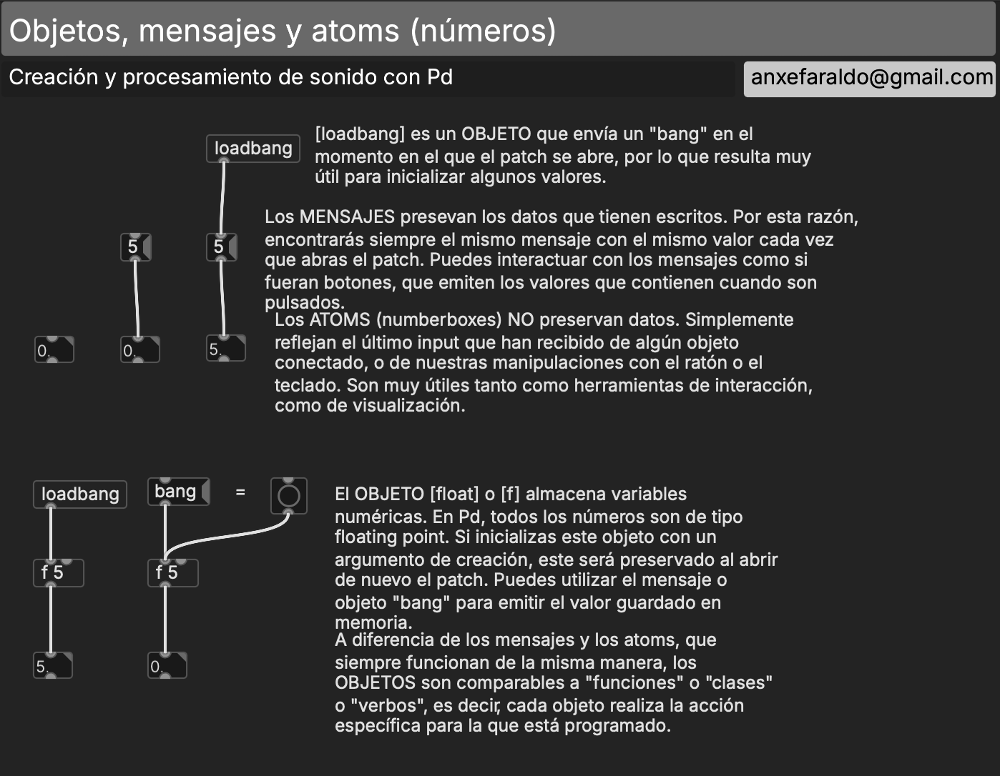{ .patch }

- Modo edición frente a modo *performance*. El mismo programa es a la vez código e interfaz, composición e instrumento. Nos convierte en luthieres y *performers* digitales simultáneamente.

### MIDI: la nota como número

MIDI (*Musical Instrument Digital Interface*) es el protocolo de comunicación entre instrumentos, ordenadores y programas de música. Se publicó en 1983 y sigue siendo el estándar de toda DAW. Define notas, controladores de expresión y cambios de programa como mensajes formados por números entre 0 y 127.

Lo que en tu DAW es un rectángulo en un *piano roll*, aquí son tres números: **altura** (60 es el Do central; +12, una octava), **velocidad** (la intensidad del ataque) y **duración**.

??? info "MIDI en detalle"
    **Qué es.** *Musical Instrument Digital Interface*: un protocolo de comunicación que entienden todos los fabricantes de hardware y software. Lo cerró en 1983 un consorcio de fabricantes (Korg, Oberheim, Roland, Sequential Circuits, Yamaha), y enseguida llegaron al mercado instrumentos que lo usaban, como el Yamaha DX7. Es la lengua franca de los instrumentos electrónicos, a costa de algunas generalizaciones, es decir, de algunas limitaciones.

    

    *Flujo de datos de un sistema MIDI sencillo: un controlador manda mensajes, un instrumento los convierte en sonido.*

    Se puede pensar MIDI como la mezcla de los dos grandes paradigmas de la producción musical: **el teclado y la mesa de mezclas**.

    

    **Cronología**

    - 1981 · *Universal Synthesizer Interface*, propuesta de Dave Smith y Chet Wood.
    - 1983 · [MIDI 1.0](https://www.midi.org/articles-old/historical-early-midi-documents-uncovered).
    - 1991 · [General MIDI](https://en.wikipedia.org/wiki/General_MIDI): instrumentos y polifonía estandarizados.
    - 1996 · [Especificación detallada de MIDI 1.0](https://www.midi.org/specifications-old/item/the-midi-1-0-specification).
    - 2020 · [MIDI 2.0](https://www.midi.org/articles-old/details-about-midi-2-0-midi-ci-profiles-and-property-exchange).

    **Tipos de datos**

    - Casi todo con 7 bits de resolución: 128 valores, de 0 a 127. Un modelo instrumental conservador, pensado desde la industria (el teclado de Moog, no el panel de Buchla).
    - **Notas:** altura + velocidad. La duración no existe como dato: es el tiempo entre el *note on* y el *note off* (que suele ser un *note on* con velocidad 0).
    - **Controladores:** volumen, panorama, efectos, expresión. [Usos habituales](https://midi.org/midi-1-0-control-change-messages).
    - **Cambios de programa:** la «paleta orquestal» de General MIDI.
    - ***Pitch bend*:** 7 + 7 bits, 16.384 pasos.
    - **Mensajes exclusivos de sistema**, reservados a cada fabricante.
    - **Canales:** 16 por puerto. Cada uno con 128 alturas, 128 velocidades, 128 controladores de 128 valores y 128 programas.

    Con MIDI 2.0 la velocidad pasa a 16 bits, y controladores, presión y *pitch bend* a 32.

    **Tablas de referencia**

    

    

    

    **Para saber más:** [midi.org](https://midi.org) · [Introduction to MIDI](https://www.youtube.com/watch?v=jT8lXP-H8HA) · [What is MIDI](https://www.youtube.com/watch?v=SUUxmJ84dnI) · [A History of MIDI](https://www.youtube.com/watch?v=FHmshRb5HQs)

### La teoría musical como flujo de datos

Si una nota es un número, la teoría musical se convierte en aritmética, y cada operación es un pequeño problema de flujo de datos: qué entra por dónde, en qué orden y qué se guarda.

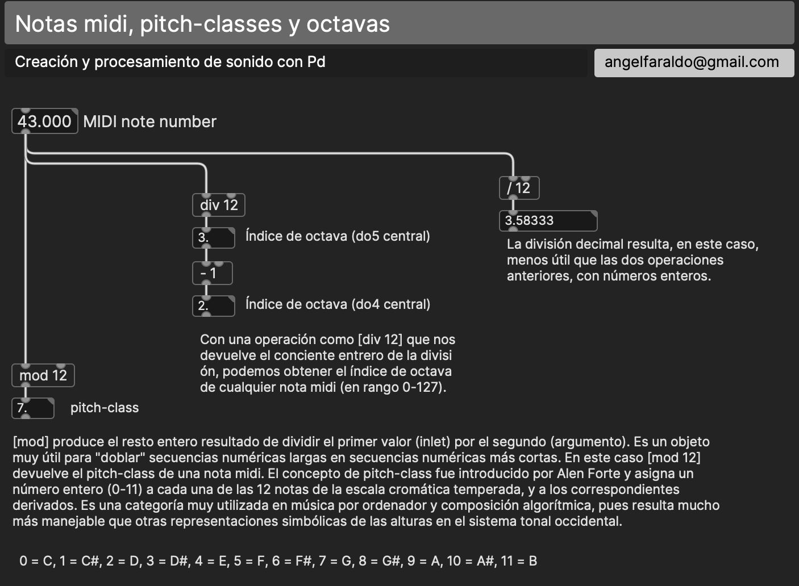{ .patch }

- **Clase de altura:** `[mod 12]` devuelve el resto de dividir por 12. 60, 72 y 48 son todos 0: Do, en cualquier octava.
- **Octava:** `[div 12]` devuelve el cociente. 60 está en la octava 5; 72, en la 6.
- **Transposición:** sumar. En `[+ 7]`, el intervalo está guardado en la entrada **fría** (la derecha): cambiarlo no hace sonar nada; la nota que entra por la **caliente** (la izquierda) sale transportada. Frío y caliente, con sentido musical.
- **Inversión:** reflejar respecto a un eje. Con eje en 60, la nota *n* se convierte en 120 − *n*: lo que subía, baja.

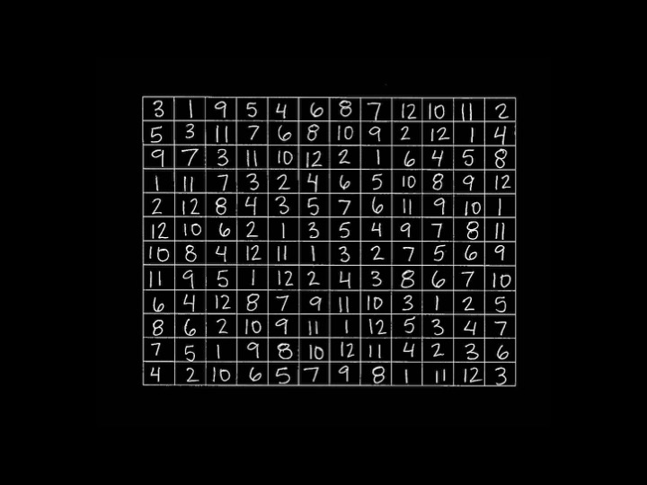

*Matriz dodecafónica: la serie y su inversión son aritmética sobre los números del 0 al 11. Su retrogradación, en cambio, necesita una secuencia que se pueda leer al revés: eso, en la S2.*

### Que suene: plugdata y tu DAW

#### Conectar plugdata con tu DAW

Hay dos caminos. El más universal: plugdata como aplicación independiente manda MIDI por un **puerto virtual** a un instrumento de tu DAW.

- En Mac, el bus IAC (*Configuración de Audio MIDI*, en *Aplicaciones › Utilidades*), o los puertos virtuales que crea plugdata («from plugdata» / «to plugdata»).
- En Windows, [loopMIDI](https://www.tobias-erichsen.de/software/loopmidi.html).

*Para usar el bus inter-aplicación en Mac hay que activarlo en la Configuración de Audio MIDI del sistema.*

*En las preferencias de audio y MIDI de plugdata se eligen los puertos de entrada y salida.*

El segundo camino: **plugdata como plugin dentro de la DAW**. Las notas que genera el patch pasan directamente al siguiente instrumento de la cadena.

*plugdata en un canal de Reaper: las notas del patch van al instrumento que tiene a continuación (aquí, un sinte FM).*

??? note "Logic y Ableton Live"
    

    *Logic distingue plugins de audio y de MIDI: plugdata se inserta como plugin MIDI delante del instrumento.*

    

    *En Live, plugdata-fx va en una pista MIDI, y la pista del instrumento recibe de ella (con la monitorización activa).*

#### Enviar notas: `[makenote]` y `[noteout]`

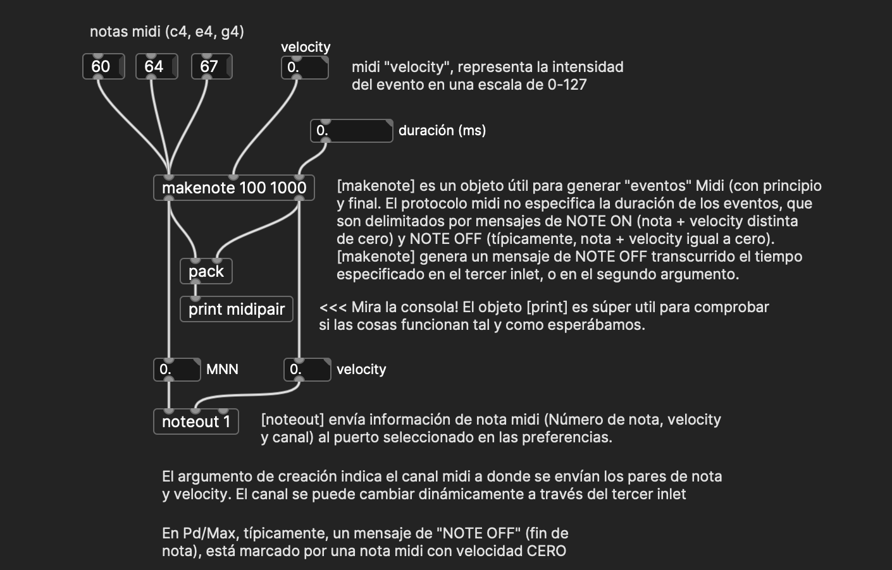{ .patch }

`[makenote]` convierte un número en un evento completo: manda el *note on* y, pasado el tiempo indicado, su *note off*. Sin *note off*, la nota se queda colgada en la DAW. La velocidad y la duración entran por la derecha (frías); la altura entra por la izquierda (caliente) y dispara el evento. Lo de la mañana, con sonido: si la velocidad llega después que la altura, la nota sale con la velocidad anterior.

### Tiempo y estado: `[metro]` y el contador

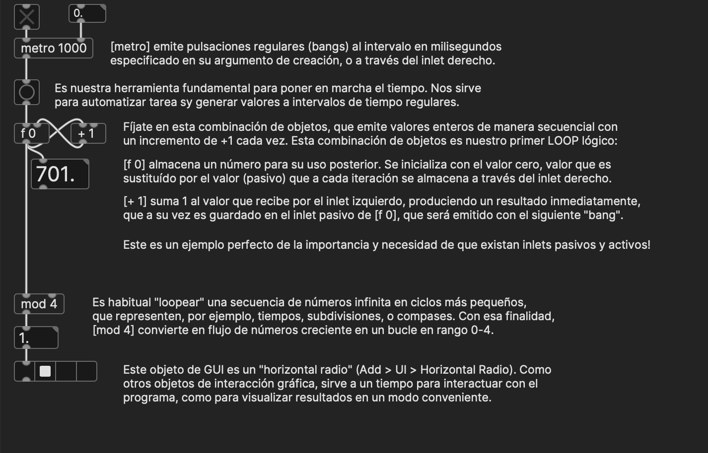{ .patch }

`[metro]` produce pulsos regulares. La pareja `[f]` × `[+ 1]` guarda un número y lo incrementa en cada pulso: es el **estado**, la memoria mínima de un programa. Con `[mod n]` el contador da vueltas, y ya tenemos un ciclo de *n* pasos.

#### Azar dentro de una escala

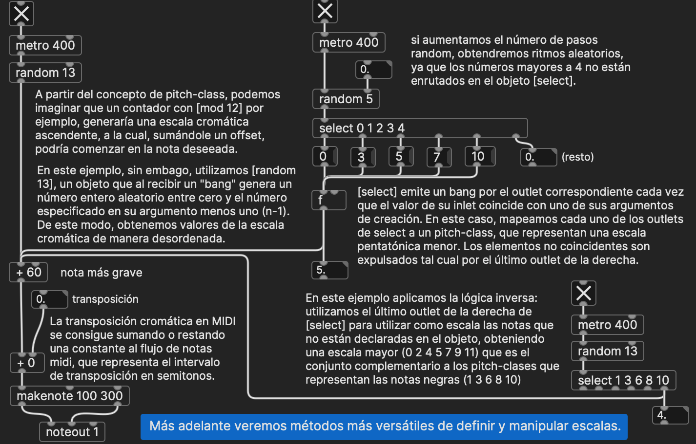{ .patch }

`[random n]` devuelve un número entre 0 y *n*−1. Si en lugar de mandarlo directamente lo usamos como índice de una **tabla** que contiene una escala, el azar queda dentro de un orden que hemos decidido nosotros. Esa tabla volverá en todas las sesiones: en la S2 será una partitura, en la S3 un sonido.

### Objetos de interacción y gráfica en Pd

Para facilitar la interacción con los patches en modo «instrumento» hay una serie de objetos configurables que sirven para visualizar o manipular datos. Los más comunes implementan metáforas de hardware de sonido y de interacción de usuario estándar (*sliders*, *knobs*, *radios*, cajas de números, etc.).

La distribución básica de Pd (vanilla) viene con algunos de estos elementos, que funcionan en cualquier distribución y entorno.

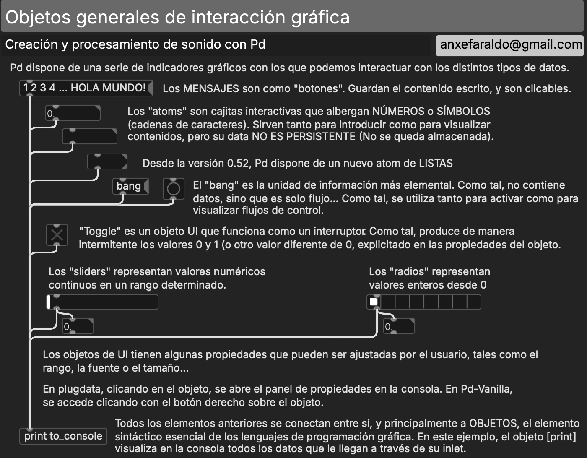{ .patch }

Otras librerías, como ELSE, añaden metáforas más específicas, como teclados, osciloscopios, espectrogramas, etc., que pueden resultarnos muy útiles.

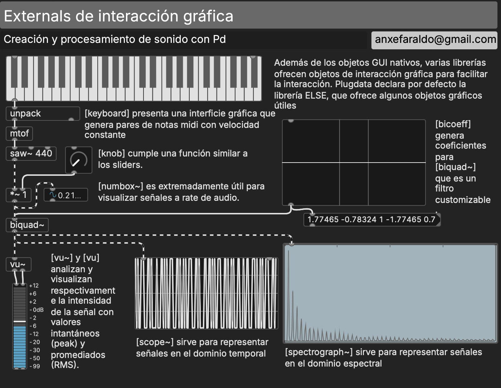{ .patch }

plugdata facilita la interacción con el entorno de programación con ayudas contextuales y listados de contenido.

Algo propio de los objetos de interacción gráfica, pero no restringido a ellos, es la posibilidad de conectar objetos sin cables. Para ello usamos `[send]` y `[receive]` (en la S2 veremos sus equivalentes para audio).

### Introducción a la programación en Pd

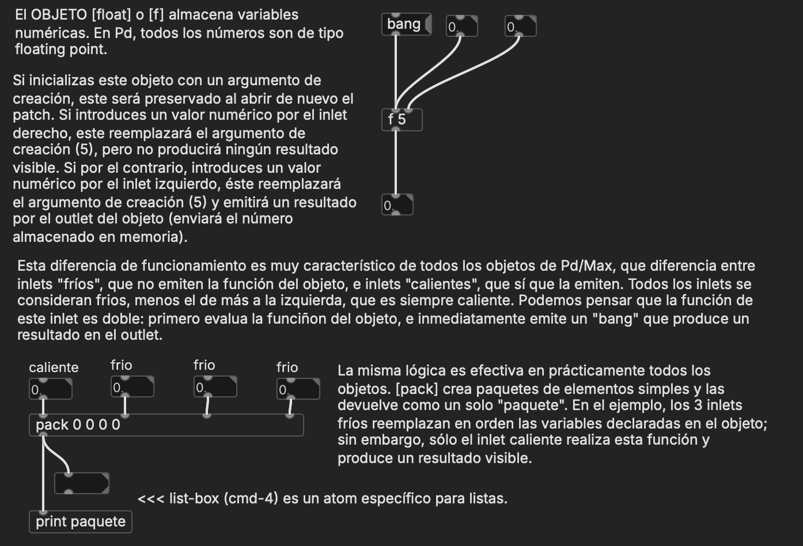{ .patch }

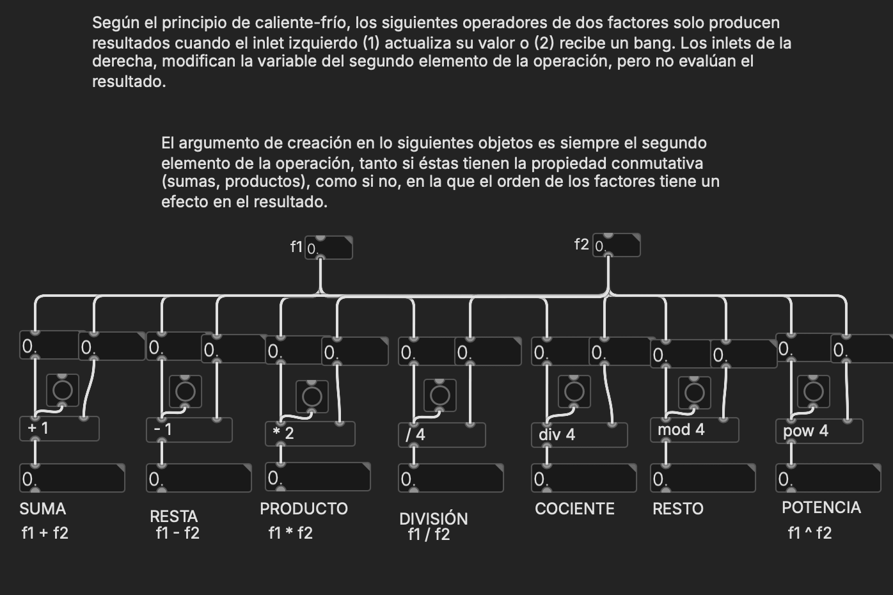{ .patch }

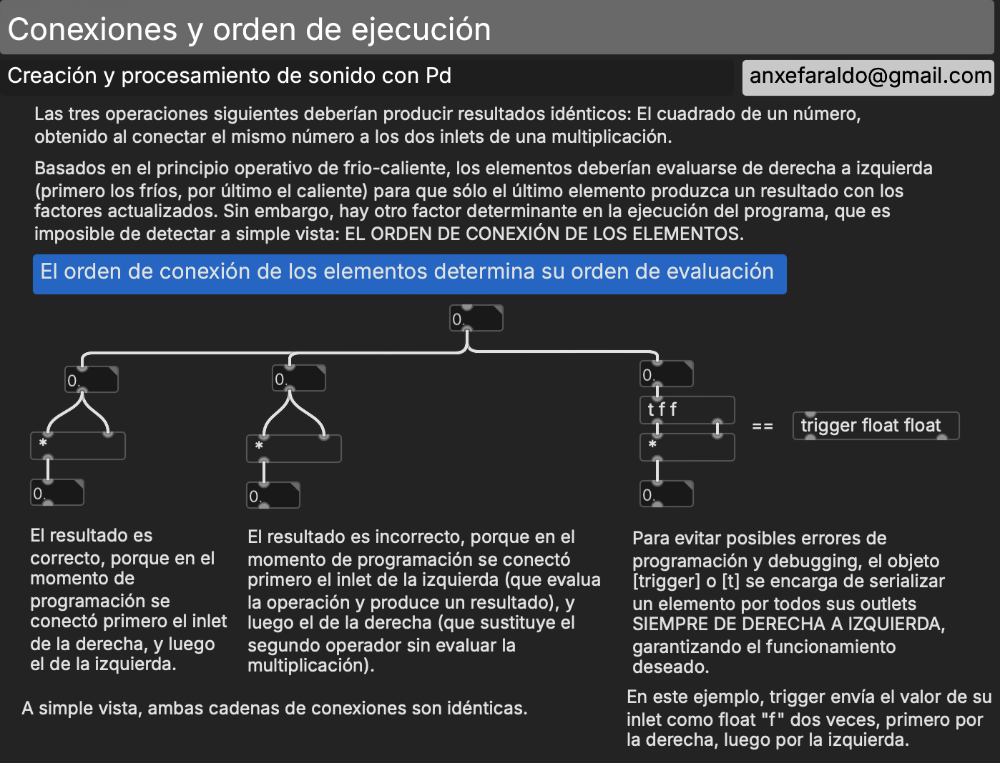{ .patch }

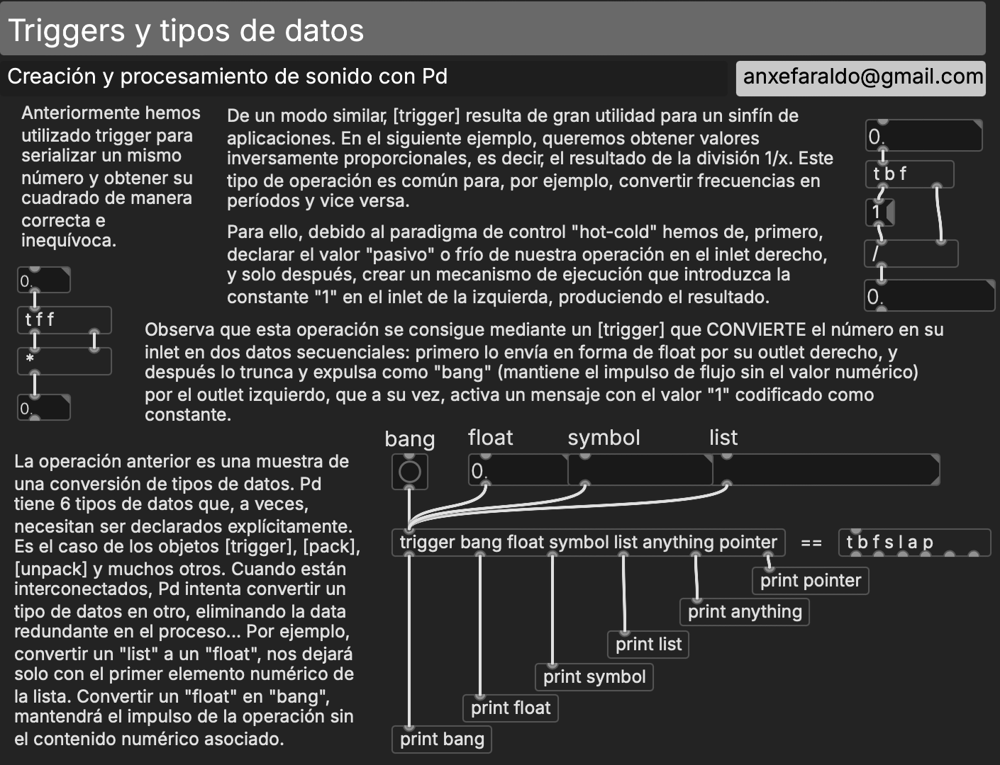{ .patch }

## Patches de referencia

Los patches de referencia de esta sesión se publican aquí al acabar la clase. En clase no se reparten antes: se construyen.

## Para seguir por tu cuenta

Dos fuentes, las dos incluidas en plugdata: los ejemplos de la documentación de Pd (*Ayuda › Navegador › Pure Data*) y, en la misma ayuda, el *Live Electronics Tutorial* de Alexandre Porres (carpeta `12.live-electronics-tutorial`, en inglés). Más detalles y el mapa de todo el curso, en [Recursos](../recursos.md#para-seguir-por-tu-cuenta).

**Documentación de Pd**

- `2.control.examples`: 01 a 11 (mensajes, conexiones, contador, tiempo, orden «profundidad primero», `send`/`receive`) y 17 (MIDI).

**Live Electronics Tutorial (Porres)**

- *The Basics › Pd Quickstart*: `1.Elementary` (elementos, edición, objetos) y `2.Syntax` (frío y caliente, orden de los mensajes, `send`/`receive`).
- *The Basics › Intervals-Tuning*: intervalos, cents, MIDI y MIDIcents. La teoría musical como números.
- *Control › MIDI-CV-OSC-Net › MIDI*: `MIDI.note`, `MIDI.objects`, `Anatomy.of.MIDI.Messages`.

## Lecturas

- Collins, N., Schedel, M. y Wilson, S. *Electronic Music*. Cambridge Introductions to Music. [PDF](https://lamembrana.com/radio-katarina/lecturas/collins-schedel-wilson-electronic-music.pdf)

!!! tip "Más recursos"
    Sitios de referencia, bibliografía general y tutoriales para todo el curso: [Recursos](../recursos.md).
