# S1 · Lógica de la programación gráfica

!!! note "Sesión 1 · sábado 3 de octubre de 2026"
    **Antes de venir:** instala plugdata y trae tu ordenador con tu DAW habitual instalada, y auriculares. En Mac, activa el bus IAC (Configuración de Audio MIDI); en Windows, instala loopMIDI. Si algo no funciona, no te preocupes: lo resolvemos durante la sesión.

¿Qué decide el sistema y qué decide la intérprete?

<ol>
<li data-src="audio/s1/ciani-buchla-concerts-1975.mp3"><b>Suzanne Ciani</b> · <i>Live Buchla Concert</i> (1975)</li>
<li data-src="audio/s1/barbieri-patterns-of-consciousness.mp3"><b>Caterina Barbieri</b> · <i>Scratches on the Readable Surface</i> (<i>Patterns of Consciousness</i>, 2017)</li>
<li data-src="audio/s1/spiegel-expanding-universe.mp3"><b>Laurie Spiegel</b> · <i>A Folk Study</i> (<i>The Expanding Universe</i>, 1980)</li>
</ol>

[Guía de escucha →](../escuchas/s1.md){ .radio-guia }

## Plan de la sesión

**Mañana**

1. Presentación de la asignatura: objetivos, calendario, encargos, defensas y evaluación. Qué se evalúa y por qué. Si planeas utilizar inteligencia artificial, revisa los consejos de [uso de inteligencia artificial](../index.md#uso-de-inteligencia-artificial) en el plan de la asignatura.
2. El lenguaje: objetos, mensajes y números; entradas calientes y frías; orden de ejecución y `[trigger]`; contador `[f]`×`[+ 1]`.
3. La nota como número: teoría musical básica como flujo de datos. MIDI, altura, octava, transposición, inversión y escalas, convertidas en operaciones.
4. Taller de predicción: antes de hacer clic, escribe qué va a pasar.

**Tarde**

1. Escucha: Suzanne Ciani, *Live Buchla Concert* (1975) · Caterina Barbieri, *Patterns of Consciousness* (2017). ¿Qué decide el sistema y qué decide la intérprete?
2. Puesta en marcha: qué es MIDI (*note on* y *note off*, velocidad, canales); plugdata dentro de la DAW, `[makenote]` y `[noteout]`.
3. Tiempo y azar: `[metro]` mueve el contador, `[random]` genera números al azar, con `[sel]` se pueden crear reglas de cambio o parar el sistema.
4. Presentación del encargo [E1](../encargos/e1.md): una pieza de una voz con tus propias reglas. En el taller programamos juntas el punto de partida.
5. Taller: la *Máquina de reglas*. Programamos juntas, cada una en su ordenador y sonando en su DAW, una máquina mínima que decide el tiempo y la nota (altura y velocidad). ¿Qué cambia si cambiamos cada regla? Todo lo demás que se puede regular (duración, articulación, registro, forma, final) es tuyo en el E1.

## Taller de predicción

El taller aparece aquí al empezar la clase.

## Contenidos de referencia

### ¿Qué es Pure Data (Pd)?

- Pd es un lenguaje de programación gráfica concebido para generar y procesar sonido, música y multimedia, de código abierto y gratuito.
- Es un dialecto de la familia Max (ambos modelos desarrollados por Miller Puckette).
- Pd funciona en los tres sistemas operativos mayoritarios (Mac, Windows, Linux). También funciona en smartphones (iOS, Android), así como en la web.
- Pd se puede insertar como motor de audio en otros entornos de desarrollo (Python, C++, Unity, Processing, etc.).
- Pd vía plugdata puede funcionar dentro de cualquier DAW como plugin de audio o MIDI en la mayoría de formatos de plugins (VST3, AU, LV2, CLAP).
- Pd es un lenguaje pequeño (pocos objetos), y por eso resulta idóneo en contextos de aprendizaje.
- Pd utiliza pocos recursos computacionales, así que puede correr en ordenadores poco potentes (como smartphones o Raspberry Pi). Esto lo convierte en una herramienta especialmente idónea para creaciones colaborativas o instalaciones sonoras.

!!! info "plugdata"
    Para esta asignatura utilizaremos [plugdata](https://plugdata.org/) (última versión estable), una distribución de Pd con documentación, ayuda y vocabulario adicional, así como con una interfaz visual amigable. Está disponible para todos los sistemas operativos principales, y se puede utilizar tanto como aplicación independiente como plugin VST3, CLAP o AU.

    Ayuda contextual: con un objeto seleccionado, plugdata muestra qué hace, sus entradas y salidas, y abre su ayuda.

    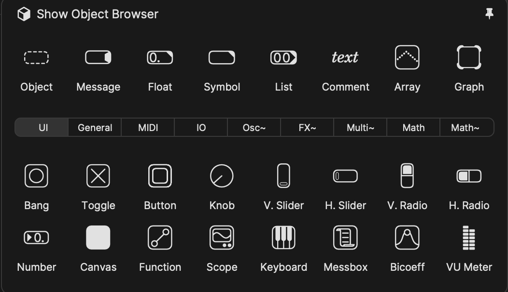

!!! note "¿Y Pd vanilla?"
    Si por cualquier motivo prefieres trabajar con [Pd vanilla](https://msp.ucsd.edu/software.html) (la distribución oficial desarrollada y mantenida por Miller Puckette, que es la base del lenguaje), es perfectamente posible: ambas distribuciones son idénticas en lo que a paradigma de programación y vocabulario se refiere. Ten en cuenta, eso sí, que en clase usaremos también ELSE y cyclone, que en vanilla hay que instalar aparte.

### El lenguaje

Pd se programa conectando cajas: los datos fluyen de una a otra por los cables, como la señal por un circuito o por un sintetizador modular. El mismo programa es a la vez código e interfaz, composición e instrumento: en modo edición lo construyes, en modo *performance* lo tocas.

??? info "Antes de Pd: el flujo de datos en la electrónica musical"
    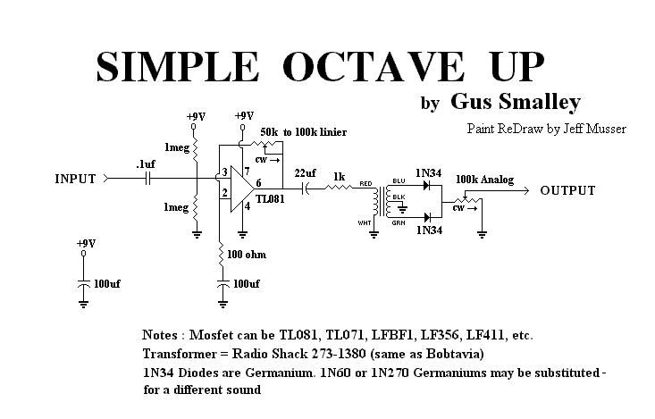

    *Diagrama electrónico de un pedal «octavador» para guitarra (esquema de Gus Smalley, redibujado por Jeff Musser).*

    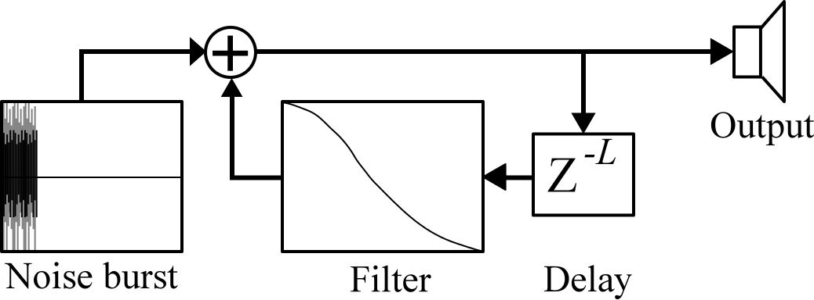

    *Representación diagramática del algoritmo de síntesis digital Karplus-Strong, un modelado físico sencillo de la vibración de una cuerda tras ser excitada por un martillo o púa. Esta técnica de síntesis se ha usado mucho para emular guitarras, bajos o claves.*

    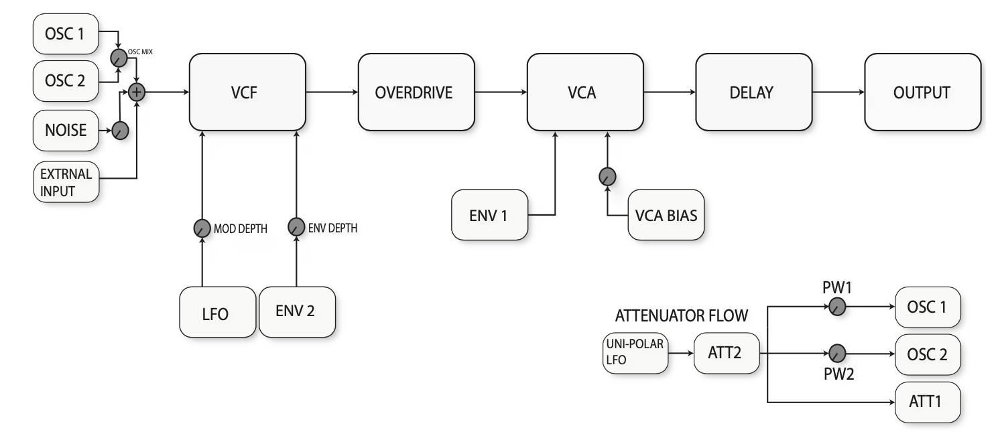

    *Flujo de señal del sintetizador semimodular Neutron de Behringer. El instrumento viene con un enrutado de serie que se puede alterar con conexiones en su propio «patchbay».*

??? info "Otros entornos de programación gráfica"
    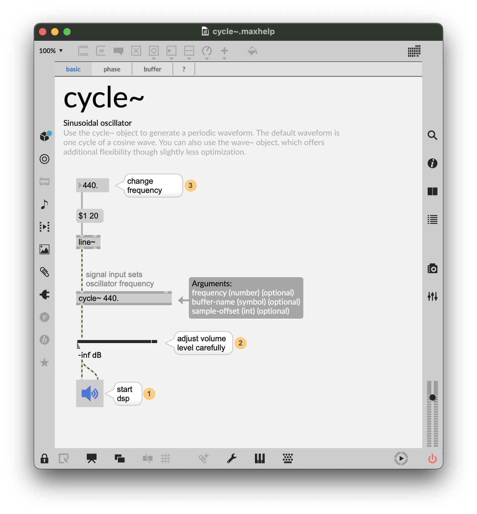

    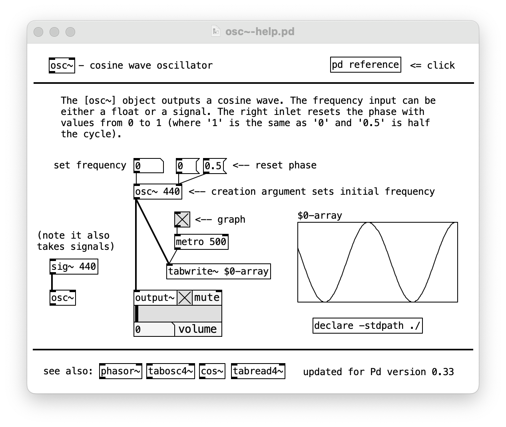

    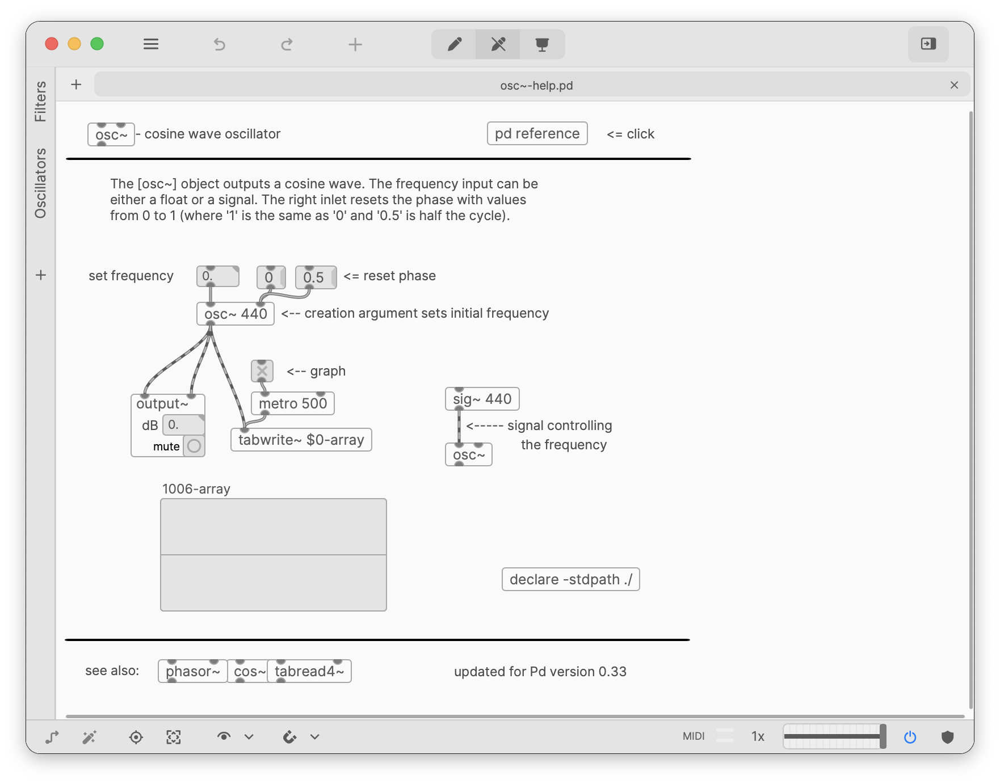

#### Objetos, mensajes y números

- **Objetos** (`[+ 7]`, `[print]`, `[metro]`): hacen algo con lo que les llega.
- **Mensajes** (`[5(`, `[bang(`): guardan un dato y lo envían al hacer clic.
- **Cajas de número**: muestran y envían números; se cambian arrastrando con el ratón.

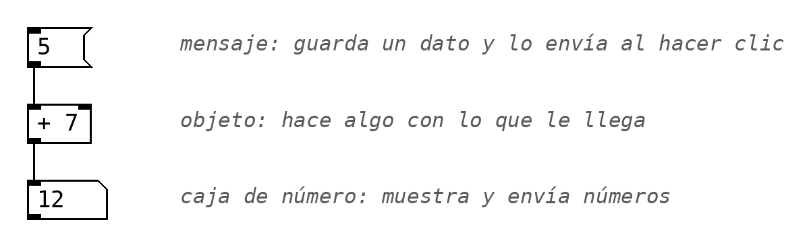{ width="601" }

#### Caliente y frío

La entrada izquierda de un objeto es **caliente**: al recibir algo, el objeto calcula y envía el resultado. Las demás son **frías**: guardan el valor y esperan. El argumento (el 7 de `[+ 7]`) es el valor inicial de la entrada fría.

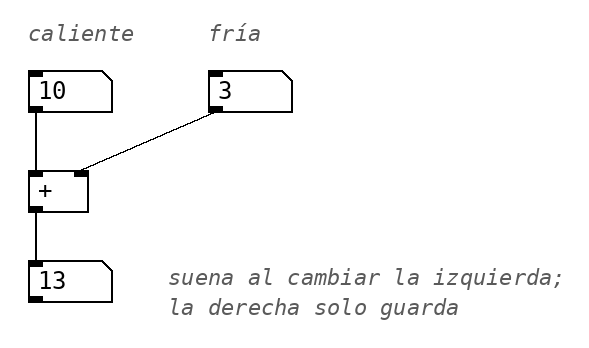{ width="416" }

#### El orden y `[trigger]`

Cuando una salida va a varios sitios, el orden importa. Pd reparte de derecha a izquierda y llega hasta el final de cada rama antes de seguir. Si el orden importa, no lo dejes al azar de cómo hiciste las conexiones: `[trigger]` (`[t b f]`…) lo fija, siempre de derecha a izquierda.

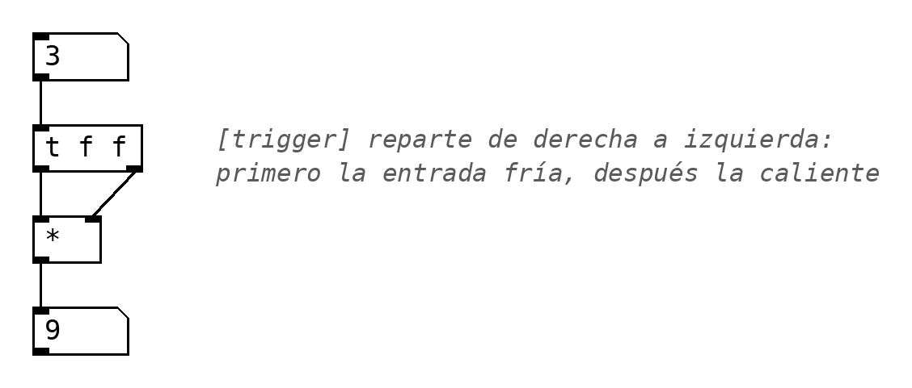{ width="564" }

#### El contador

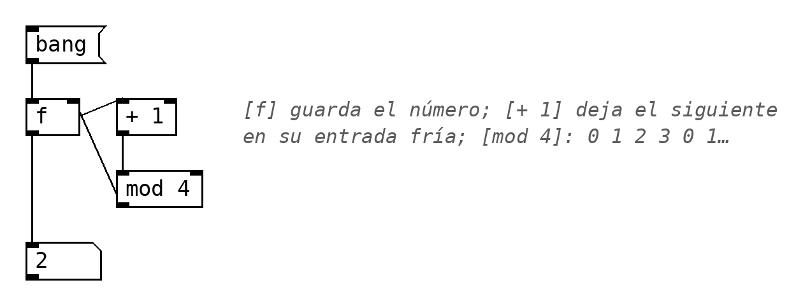{ width="630" }

La pareja `[f]` × `[+ 1]` guarda un número y lo incrementa cada vez que recibe un `bang`: es el **estado**, la memoria mínima de un programa. Con `[mod n]` el contador da vueltas, y ya tenemos un ciclo de *n* pasos. `[sel]` reacciona a valores concretos del ciclo: el principio de una sección, un final.

### La nota como número

MIDI (*Musical Instrument Digital Interface*) es el protocolo de comunicación entre instrumentos, ordenadores y programas de música. Lo que en tu DAW es un rectángulo en un *piano roll*, aquí son números entre 0 y 127: **altura** (60 es el Do central, C4; +12, una octava), **velocidad** (la intensidad del ataque) y **duración**.

Si una nota es un número, la teoría musical se convierte en aritmética, y cada operación es un pequeño problema de flujo de datos: qué entra por dónde, en qué orden y qué se guarda.

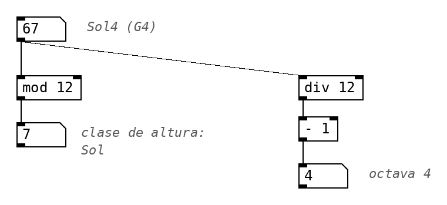{ width="539" }

- **Clase de altura:** `[mod 12]` devuelve el resto de dividir por 12. 48, 60 y 72 dan 0: Do, en cualquier octava.
- **Octava:** `[div 12]` devuelve el cociente; restándole 1 obtenemos la octava en el sistema que usamos (Do central = C4): 60 → 4, 72 → 5.
- **Transposición:** `[+ 7]` suma 7 semitonos (una quinta) a cada nota que entra por la izquierda. Para cambiar el intervalo, manda otro número a la entrada derecha: cambiarlo no hace sonar nada; la siguiente nota ya sale con el intervalo nuevo.
- **Inversión:** reflejar respecto a un eje. Una nota que está *d* semitonos por encima del eje pasa a estar *d* semitonos por debajo: con el eje en Do4 (60), la nota *n* se convierte en 120 − *n* (120 es el doble del eje). Mi4 (64), cuatro por encima, pasa a La♭3 (56), cuatro por debajo. En Pd hay que restar en este orden: `[-]` resta lo que entra por la derecha a lo que entra por la izquierda, así que la nota tiene que llegar primero a la derecha (fría) y el 120, después, a la izquierda (caliente). Es un trabajo para `[t b f]`: primero guarda la nota, después dispara el mensaje `[120(`.
- **Escalas:** una escala es una lista de grados. Con `[sel 0 1 2 3 4 5 6]` y siete mensajes (la menor natural: `0` `2` `3` `5` `7` `8` `10`), cada número del 0 al 6 elige un grado, que se suma a la nota de referencia. Es rudimentario, pero funciona; en la S2 guardaremos la escala en una **tabla**.

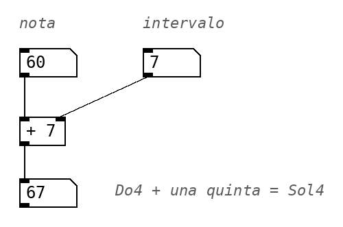{ width="353" }

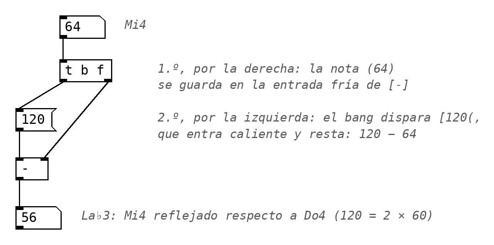{ width="640" }

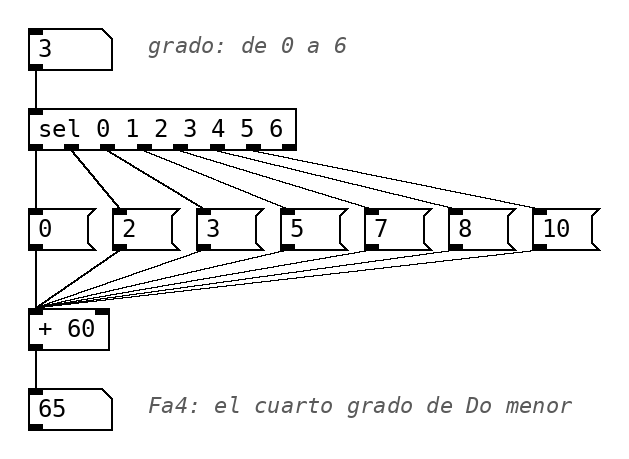{ width="446" }

### Que suene: MIDI y tu DAW

??? info "MIDI en detalle"
    **Qué es.** *Musical Instrument Digital Interface*: un protocolo de comunicación que entienden todos los fabricantes de hardware y software. Lo cerró en 1983 un consorcio de fabricantes (Korg, Oberheim, Roland, Sequential Circuits, Yamaha), y enseguida llegaron al mercado instrumentos que lo usaban, como el Yamaha DX7. Es la lengua franca de los instrumentos electrónicos, a costa de algunas generalizaciones, es decir, de algunas limitaciones.

    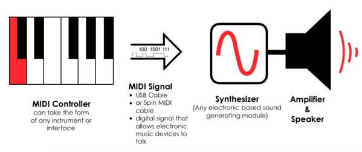

    *Flujo de datos de un sistema MIDI sencillo: un controlador manda mensajes, un instrumento los convierte en sonido.*

    Se puede pensar MIDI como la mezcla de los dos grandes paradigmas de la producción musical: **el teclado y la mesa de mezclas**.

    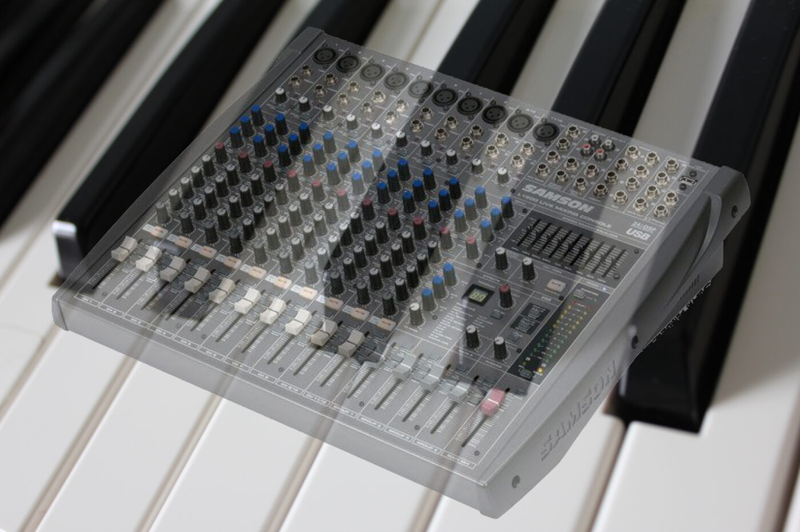

    **Cronología**

    - 1981 · *Universal Synthesizer Interface*, propuesta de Dave Smith y Chet Wood.
    - 1983 · [MIDI 1.0](https://www.midi.org/articles-old/historical-early-midi-documents-uncovered).
    - 1991 · [General MIDI](https://en.wikipedia.org/wiki/General_MIDI): instrumentos y polifonía estandarizados.
    - 1996 · [Especificación detallada de MIDI 1.0](https://www.midi.org/specifications-old/item/the-midi-1-0-specification).
    - 2020 · [MIDI 2.0](https://www.midi.org/articles-old/details-about-midi-2-0-midi-ci-profiles-and-property-exchange).

    **Tipos de datos**

    - Casi todo con 7 bits de resolución: 128 valores, de 0 a 127. Un modelo instrumental conservador, pensado desde la industria (el teclado de Moog, no el panel de Buchla).
    - **Notas:** altura + velocidad. La duración no existe como dato: es el tiempo entre el *note on* y el *note off* (que suele ser un *note on* con velocidad 0).
    - **Controladores:** volumen, panorama, efectos, expresión. [Usos habituales](https://midi.org/midi-1-0-control-change-messages).
    - **Cambios de programa:** la «paleta orquestal» de General MIDI.
    - ***Pitch bend*:** 7 + 7 bits, 16.384 pasos.
    - **Mensajes exclusivos de sistema**, reservados a cada fabricante.
    - **Canales:** 16 por puerto. Cada uno con 128 alturas, 128 velocidades, 128 controladores de 128 valores y 128 programas.

    Con MIDI 2.0 la velocidad pasa a 16 bits, y controladores, presión y *pitch bend* a 32.

    **Tablas de referencia**

    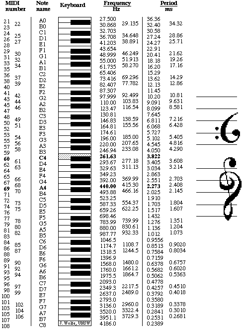

    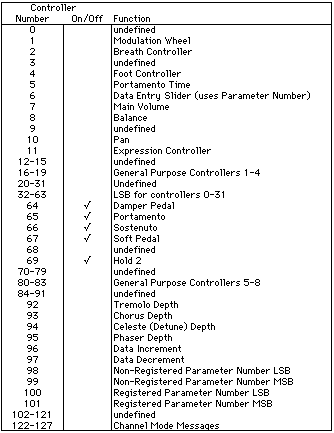

    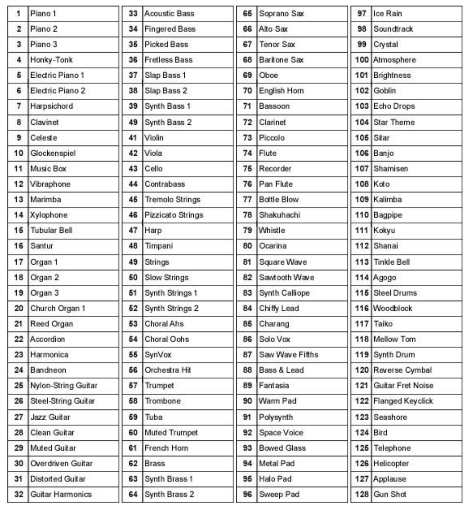

    **Para saber más:** [midi.org](https://midi.org) · [Introduction to MIDI](https://www.youtube.com/watch?v=jT8lXP-H8HA) · [What is MIDI](https://www.youtube.com/watch?v=SUUxmJ84dnI) · [A History of MIDI](https://www.youtube.com/watch?v=FHmshRb5HQs)

#### Conectar plugdata con tu DAW

Hay dos caminos. El más universal: plugdata como aplicación independiente manda MIDI por un **puerto virtual** a un instrumento de tu DAW.

- En Windows, [loopMIDI](https://www.tobias-erichsen.de/software/loopmidi.html).

- En Mac, el bus IAC (*Configuración de Audio MIDI*, en *Aplicaciones › Utilidades*), o los puertos virtuales que crea plugdata («from plugdata» / «to plugdata»).

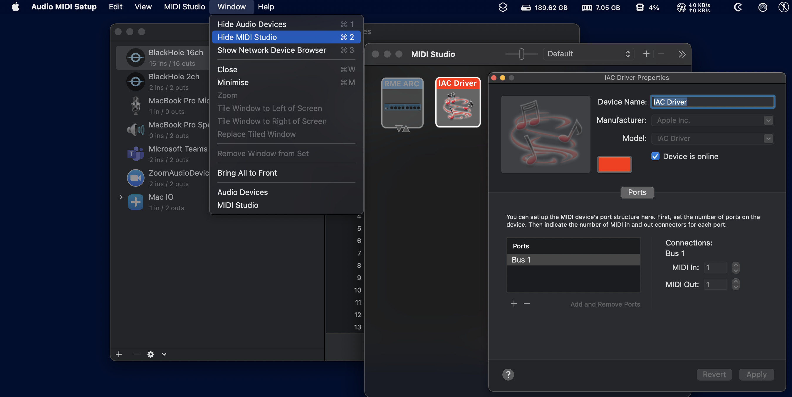

*Para usar el bus inter-aplicación en Mac hay que activarlo en la Configuración de Audio MIDI del sistema.*

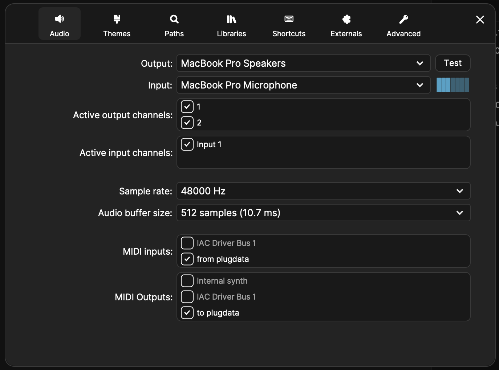

*En las preferencias de audio y MIDI de plugdata se eligen los puertos de entrada y salida.*

El segundo camino: **plugdata como plugin dentro de la DAW**. Las notas que genera el patch pasan directamente al siguiente instrumento de la cadena.

??? note "Reaper, Logic y Ableton Live"
    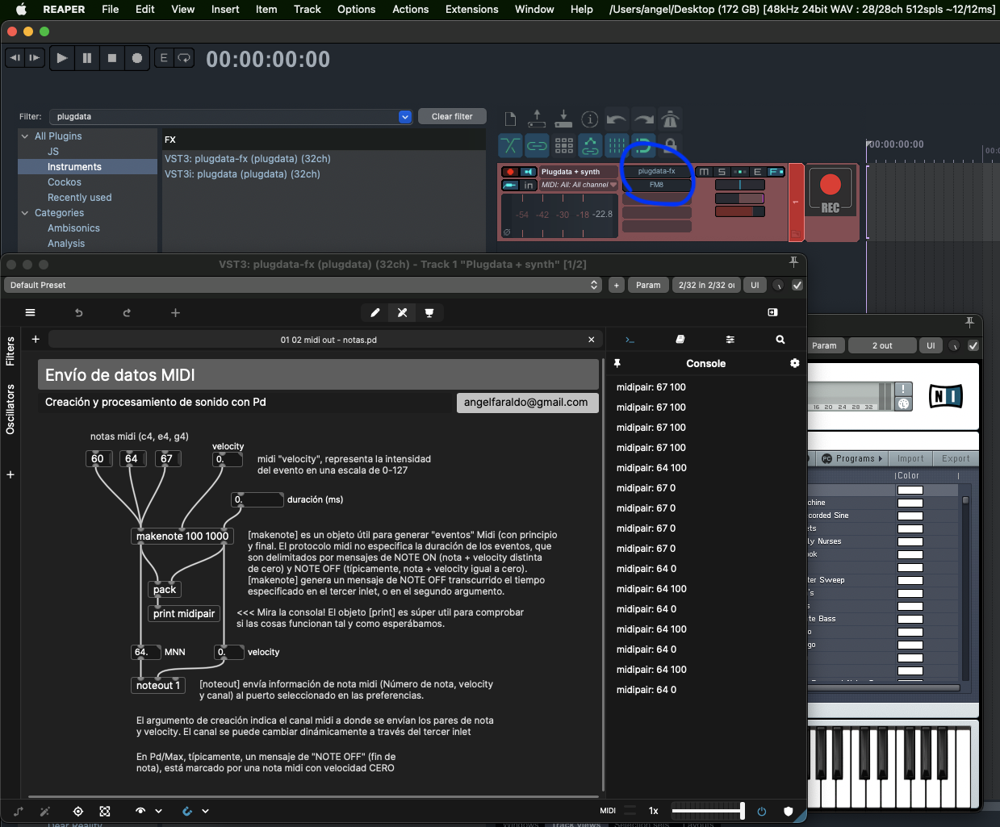

    *plugdata en un canal de Reaper: las notas del patch van al instrumento que tiene a continuación (aquí, un sinte FM).*

    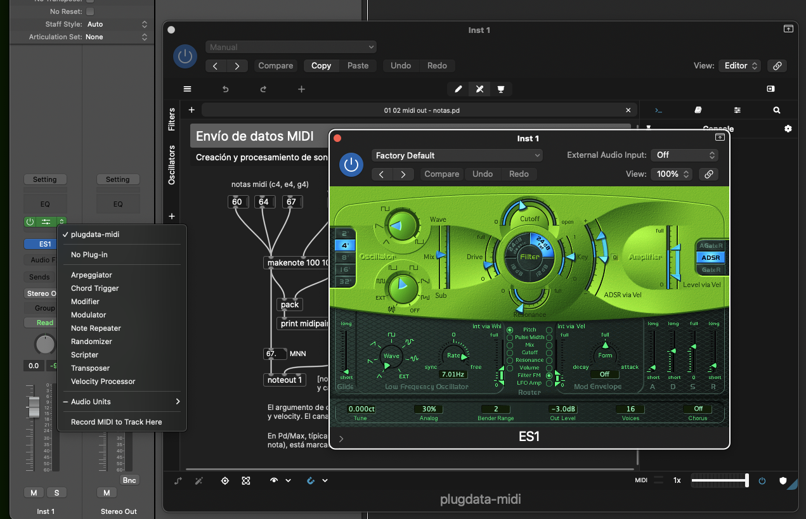

    *Logic distingue plugins de audio y de MIDI: plugdata se inserta como plugin MIDI delante del instrumento.*

    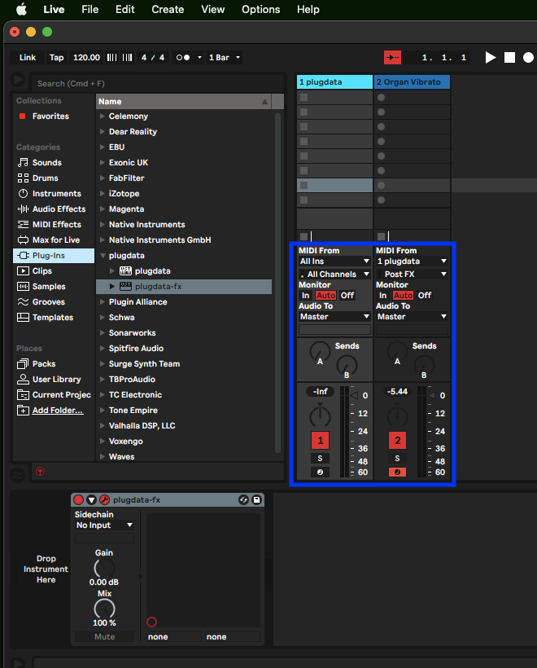

    *En Live, plugdata-fx va en una pista MIDI, y la pista del instrumento recibe de ella (con la monitorización activa).*

#### Enviar notas: `[makenote]` y `[noteout]`

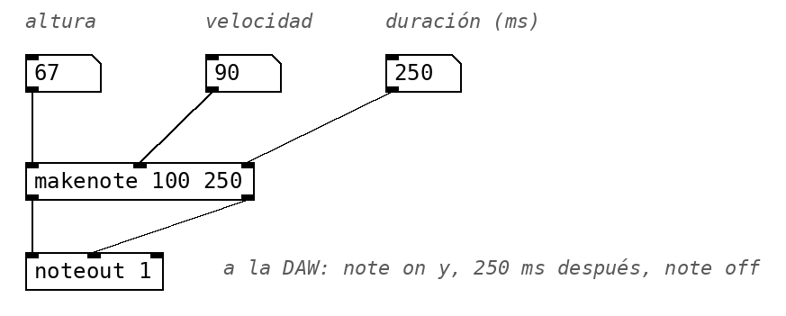{ width="616" }

`[makenote]` convierte un número en un evento completo: manda el *note on* y, pasado el tiempo indicado, su *note off*. Sin *note off*, la nota se queda colgada en la DAW. La velocidad y la duración entran por la derecha (frías); la altura entra por la izquierda (caliente) y dispara el evento: si la velocidad llega después que la altura, la nota sale con la velocidad anterior.

### Tiempo y azar

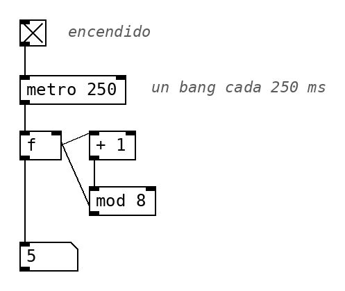{ width="352" }

`[metro]` produce pulsos regulares: conectado al contador, ya no hay que hacer clic. Un *toggle* (la casilla) lo enciende y lo apaga.

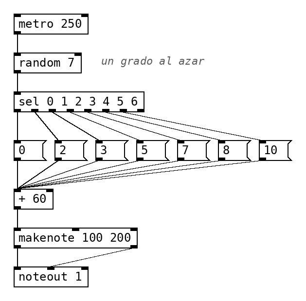{ width="446" }

`[random n]` devuelve un número entre 0 y *n*−1. Si lo mandas a la escala de la mañana en lugar de a la nota, el azar queda dentro de un orden que hemos decidido nosotras.

**Que la máquina se pare sola.** `[metro]` se apaga si recibe un `0` (o `stop`) por su entrada izquierda. Basta con que una regla se lo mande:

- **Cuando llegue a una cuenta:** un contador de eventos y `[sel 64]`: al llegar al evento 64, un mensaje `[0(` a `[metro]`.
- **Cuando lo decida el azar:** en cada evento, `[random 50]` → `[sel 0]` → `[0(`. Una posibilidad entre 50 en cada nota: nadie, ni tú, sabe cuándo acaba.
- **Cuando acabe la forma:** si tienes un contador de secciones, el final es una sección más.

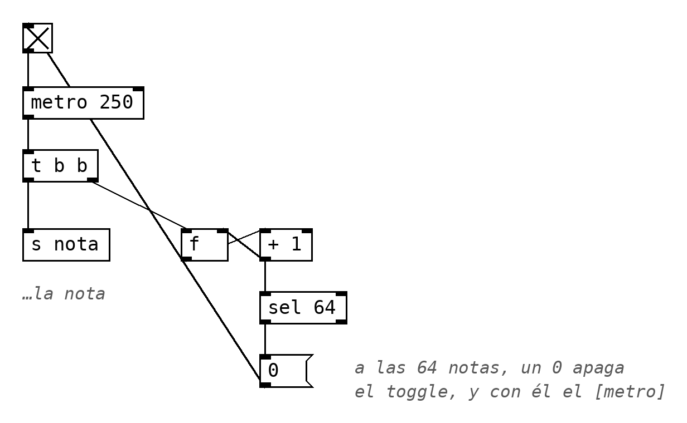{ width="616" }

Antes de parar, la última nota necesita su *note off*: si `[makenote]` ya la ha mandado, no queda colgada.

## Lo esencial de hoy

| Objetos | Para qué |
|---|---|
| mensaje, caja de número, `[print]` | Mandar, ver y comprobar datos |
| `[+ ]`, `[- ]`, `[mod ]`, `[div ]` | La teoría musical como aritmética |
| `[f]` × `[+ 1]` | El contador: el estado, la memoria mínima |
| `[trigger]` (`[t b f]`…) | Decidir el orden |
| `[sel]` | Reaccionar a un valor: secciones, finales |
| `[random]` | El azar; con `[sel]` y mensajes, dentro de una escala |
| `[metro]` | El tiempo |
| `[makenote]` · `[noteout]` | La nota completa (con su *note off*), hacia la DAW |

- **Caliente y fría.** La entrada izquierda dispara; las demás guardan.
- **El orden.** Pd reparte de derecha a izquierda y llega hasta el final de cada rama antes de seguir. Si el orden importa, `[trigger]`.
- **El estado vive en un bucle,** no en un objeto: `[f]` guarda, `[+ 1]` incrementa, `[mod]` hace que dé vueltas.
- **Una nota es un número.** Clase de altura, octava, transposición e inversión son operaciones.
- **Una máquina también puede decidir cuándo acaba.**

## Patches de referencia

Los patches de referencia de esta sesión se publican aquí al acabar la clase. En clase no se reparten antes: se construyen.

## Para seguir por tu cuenta

Dos fuentes, las dos incluidas en plugdata: los ejemplos de la documentación de Pd (*Ayuda › Navegador › Pure Data*) y, en la misma ayuda, el *Live Electronics Tutorial* de Alexandre Porres (carpeta `12.live-electronics-tutorial`, en inglés). Más detalles y el mapa de todo el curso, en [Recursos](../recursos.md#para-seguir-por-tu-cuenta).

**Documentación de Pd**

- `2.control.examples`: 01 a 11 (mensajes, conexiones, contador, tiempo, orden «profundidad primero», `send`/`receive`) y 17 (MIDI).

**Live Electronics Tutorial (Porres)**

- *The Basics › Pd Quickstart*: `1.Elementary` (elementos, edición, objetos) y `2.Syntax` (frío y caliente, orden de los mensajes, `send`/`receive`).
- *The Basics › Intervals-Tuning*: intervalos, cents, MIDI y MIDIcents. La teoría musical como números.
- *Control › MIDI-CV-OSC-Net › MIDI*: `MIDI.note`, `MIDI.objects`, `Anatomy.of.MIDI.Messages`.

## Lecturas

- *Computer Music Systems — A Brief Genealogy* ([presentación de clase, PDF](../materiales/genealogia-sistemas-musica-por-ordenador.pdf)): de dónde vienen Pd y Max, para quien quiera el contexto.
- Collins, N., Schedel, M. y Wilson, S. *Electronic Music*. Cambridge Introductions to Music. [PDF](https://lamembrana.com/radio-katarina/lecturas/collins-schedel-wilson-electronic-music.pdf)

!!! tip "Más recursos"
    Sitios de referencia, bibliografía general y tutoriales para todo el curso: [Recursos](../recursos.md).
