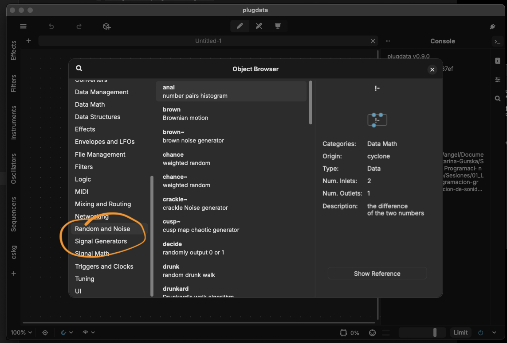
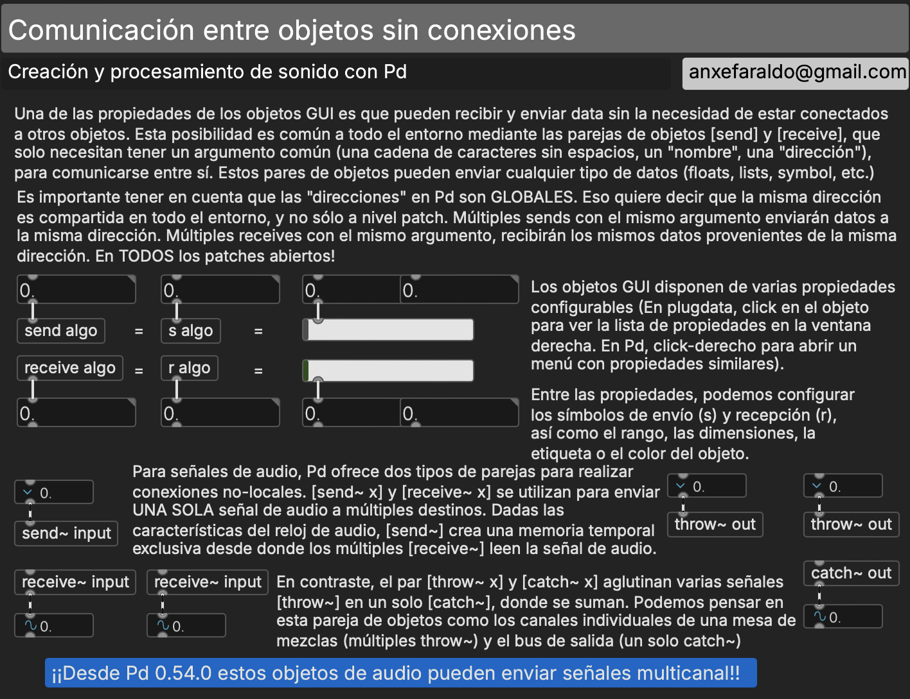

# S1 · Lógica de la programación gráfica

!!! note "Sesión 1 · sábado 3 de octubre de 2026"
    **Antes de venir:** instala plugdata y trae tu ordenador con tu DAW habitual instalada, y auriculares. En Mac, activa el bus IAC (Configuración de Audio MIDI); en Windows, instala loopMIDI. Si algo no funciona, no te preocupes: lo resolvemos al principio de la sesión.

## Plan de la sesión

**Mañana**

1. Presentación de la asignatura: objetivos, calendario, encargos, defensas y evaluación.
2. Puesta en marcha: plugdata dentro de tu DAW, y plugdata mandando MIDI a tu DAW. La nota como número.
3. El flujo de datos: objetos, mensajes, números y bang. Entradas calientes y frías. El orden de ejecución: de derecha a izquierda, `[trigger]`.
4. Taller de predicción: antes de hacer clic, escribe qué va a pasar.

**Tarde**

1. Escucha: Suzanne Ciani, *Buchla Concerts 1975* · Caterina Barbieri, *Patterns of Consciousness* (2017). ¿Qué decide el sistema y qué decide la intérprete?
2. Tiempo y estado: `[metro]`, el contador, el azar, la escala como tabla, `[makenote]` y `[noteout]`.
3. Taller de composición: *Máquina de reglas*. 90 segundos de música con una sola voz MIDI.
4. Escucha de algunas máquinas, presentación del encargo [E1](../encargos/e1.md) y cómo trabajaremos con la inteligencia artificial.

## Patches del taller de predicción

Ábrelos en modo edición y **no hagas clic** hasta haber escrito tu predicción.

- [01 · derecha-izquierda](../patches/S1/01-derecha-izquierda.pd)
- [02 · caliente-fría](../patches/S1/02-caliente-fria.pd)
- [03 · contador](../patches/S1/03-contador.pd)
- [04 · sel](../patches/S1/04-sel.pd)
- [05 · trigger frente a fan-out](../patches/S1/05-trigger-vs-fanout.pd)

## Contenidos de referencia

### Genealogía de sistemas de música por ordenador

[Computer Music Systems — A Brief Genealogy](../materiales/genealogia-sistemas-musica-por-ordenador.pdf) (presentación de clase, PDF)

### ¿Qué es Pure Data (Pd)?

- Pd es un lenguaje de programación gráfica concebido para generar y procesar sonido, música y multimedia, de código abierto y gratuito.
- Es un dialecto de la familia Max (ambos modelos desarrollados por Miller Puckette).
- Pd funciona en los tres sistemas operativos mayoritarios (Mac, Windows, Linux). También funciona en smartphones (iOS, Android), así como en la web.
- Pd se puede insertar como motor de audio en otros entornos de desarrollo (Python, C++, Unity, Processing, etc.).
- Pd vía plugdata puede funcionar dentro de cualquier DAW como plugin de audio o MIDI en la mayoría de formatos de plugins (VST3, AU, LV2, CLAP).
- Pd es un lenguaje pequeño (pocos objetos), y por eso resulta idóneo en contextos de aprendizaje.
- Pd utiliza pocos recursos computacionales, así que puede correr en ordenadores poco potentes (como smartphones o Raspberry Pi). Esto lo convierte en una herramienta especialmente idónea para creaciones colaborativas o instalaciones sonoras.

!!! info "plugdata"
    Para esta asignatura utilizaremos [plugdata](https://plugdata.org/) (última versión estable), una distribución de Pd con documentación, ayuda y vocabulario adicional, así como con una interfaz visual amigable. Está disponible para todos los sistemas operativos principales, y se puede utilizar tanto como aplicación independiente como plugin VST3, CLAP o AU.

!!! note "¿Y Pd vanilla?"
    Si por cualquier motivo prefieres trabajar con [Pd vanilla](https://msp.ucsd.edu/software.html) (la distribución oficial desarrollada y mantenida por Miller Puckette, que es la base del lenguaje), es perfectamente posible: ambas distribuciones son idénticas en lo que a paradigma de programación y vocabulario se refiere. Ten en cuenta, eso sí, que en clase usaremos también ELSE y cyclone, que en vanilla hay que instalar aparte.

### Lógica de programación en Pd / Max

#### Modelos de flujo de datos

*Diagrama electrónico de un pedal «octavador» para guitarra (esquema de Gus Smalley, redibujado por Jeff Musser).*

*Representación diagramática del algoritmo de síntesis digital Karplus-Strong, un modelado físico sencillo de la vibración de una cuerda tras ser excitada por un martillo o púa. Esta técnica de síntesis se ha usado mucho para emular guitarras, bajos o claves.*

*Flujo de señal del sintetizador semimodular Neutron de Behringer. El instrumento viene con un enrutado de serie que se puede alterar con conexiones en su propio «patchbay».*

#### Ecosistemas y entornos de programación gráfica

#### Conceptos básicos del paradigma «Max»

- Interconexión modular de elementos unitarios sencillos:
    - objetos;
    - mensajes;
    - *atoms* (números, símbolos, listas) para interacción gráfica.

- Flujos de control en paralelo: *audio rate* frente a *control rate*.
    - **Reloj de generación de audio**, es decir, la frecuencia de muestreo. Su computación se activa o desactiva explícitamente. Evaluación continua.
    - **Flujo de control de datos**, ≤ 1000 ms (el límite de computación de datos de control es 1000 Hz). Declaración no explícita: se evalúa siempre que el programa esté abierto. Evaluación bajo demanda, con activaciones dentro del patch.

- Modo edición frente a modo *performance*. El mismo programa es a la vez código e interfaz, composición e instrumento. Nos convierte en luthieres y *performers* digitales simultáneamente.

### Generación básica de sonido en Pd

Pd dispone de muchos otros objetos para generar y manipular sonido. En el *object browser* de plugdata puedes acceder a muchos de ellos, agrupados en las categorías «Signal Generators» y «Random and Noise».

### Objetos de interacción y gráfica en Pd

Para facilitar la interacción con los patches en modo «instrumento» hay una serie de objetos configurables que sirven para visualizar o manipular datos. Los más comunes implementan metáforas de hardware de sonido y de interacción de usuario estándar (*sliders*, *knobs*, *radios*, cajas de números, etc.).

La distribución básica de Pd (vanilla) viene con algunos de estos elementos, que funcionan en cualquier distribución y entorno.

Otras librerías, como ELSE, añaden metáforas más específicas, como teclados, osciloscopios, espectrogramas, etc., que pueden resultarnos muy útiles.

plugdata facilita la interacción con el entorno de programación con ayudas contextuales y listados de contenido.

Algo propio de los objetos de interacción gráfica, pero no restringido a ellos, es la posibilidad de conectar objetos de control y de audio sin cables. Para ello usamos `[send]`, `[receive]`, `[throw~]` y `[catch~]`.

### Introducción a la programación en Pd

!!! tip "Más recursos"
    Sitios de referencia, bibliografía general y tutoriales para todo el curso: [Recursos](../recursos.md).
