# S2 · Teoría musical, procesado simbólico y MIDI

!!! note "Sesión 2 · sábado 31 de octubre de 2026"
    **Antes de venir:** entrega [E1](../encargos/e1.md) y trae el patch abierto: puede tocarte defenderlo. Trae la DAW preparada como en la S1 y, si tienes, un teclado MIDI (si no, usaremos el del ordenador).

¿Cuándo deja un ritmo de ser ritmo?

<ol>
<li data-src="audio/s2/nancarrow-study-21.mp3"><b>Conlon Nancarrow</b> · <i>Study No. 21 «Canon X»</i> (c. 1950)</li>
<li data-src="audio/s2/nancarrow-study-37.mp3"><b>Conlon Nancarrow</b> · <i>Study No. 37</i> (1965–69)</li>
<li data-src="audio/s2/spiegel-unseen-worlds.mp3"><b>Laurie Spiegel</b> · <i>Unseen Worlds</i> (1991)</li>
</ol>

En la S1 trabajamos con **una nota**: un número que se transporta, se invierte o se elige al azar dentro de una escala. Hoy trabajamos con **muchas notas en el tiempo**: secuencias, ciclos que se superponen, tempos que conviven. Y al final de la tarde llevaremos el tiempo a su límite, hasta que el ritmo deje de ser ritmo y se convierta en sonido.

## Plan de la sesión

**Mañana**

1. Defensa de encargos (E1).
2. Reconstrucción, sin apuntes: el contador de la S1 dando vueltas con `[mod 8]` y mandando notas transportadas.
3. La tabla como partitura: un secuenciador por pasos. Leerla al revés (retrogradación). Dos tablas de distinta longitud leídas por dos contadores: la isorritmia.
4. Taller: predicción (¿cuándo vuelven a coincidir dos ciclos?) y tocar el secuenciador desde un teclado: el MIDI que entra.

**Tarde**

1. Escucha: Conlon Nancarrow, *Study No. 21 «Canon X»* · Laurie Spiegel, *Unseen Worlds* (1991). ¿Cuándo deja un ritmo de ser ritmo?
2. Del ritmo a la altura: acelerar el secuenciador hasta que las notas dejan de oírse como notas. El límite de lo simbólico, y el paso a la señal: `[phasor~]`, `[osc~]`, señal frente a control, envolvente, `[dac~]`.
3. Taller de composición: tu secuenciador isorrítmico; una sección suena en tu propio sinte de Pd.
4. Escucha de algunos secuenciadores y presentación del encargo [E2](../encargos/e2.md).

## Contenidos de referencia

### La tabla como partitura

Una tabla (`[array]`) es una lista de números con un índice. Si cada número es una nota y el índice lo da el contador de la S1, la tabla es una **partitura**: el contador avanza, la tabla responde con la nota que toca en cada paso.

- Leer la tabla del principio al final: el original.
- Leerla del final al principio (el contador hacia atrás): la **retrogradación**, la operación que en la S1 no podíamos hacer con una sola nota.
- Transportar o invertir lo que sale de la tabla: las operaciones de la S1, ahora aplicadas a una línea entera.

#### Tempo y subdivisiones

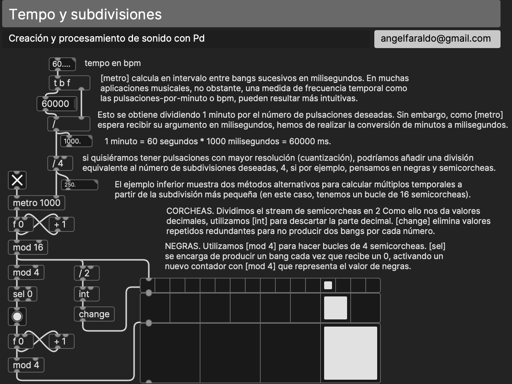

`[metro]` trabaja en milisegundos; la música, en pulsos por minuto. 60.000 ms / bpm = duración de una negra. Con `[mod]` y `[sel]` sobre un contador de semicorcheas se obtienen corcheas, negras y compases.

### Dos ciclos: la isorritmia

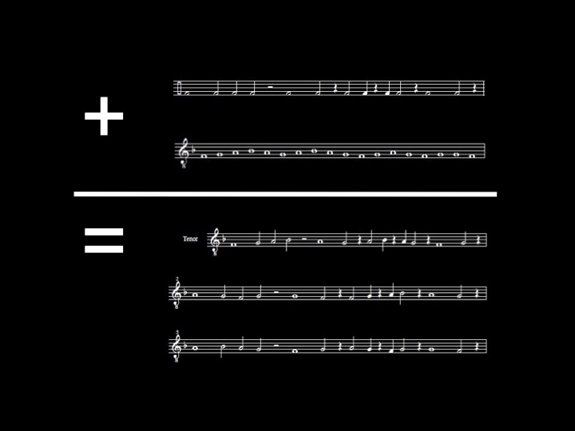

En el motete isorrítmico del siglo XIV (Machaut, Vitry), un patrón de alturas (*color*) y uno de duraciones (*talea*) de distinta longitud se repiten a la vez. Como no coinciden, cada vuelta combina alturas y duraciones de otra manera, hasta que, tras un número de vueltas, vuelven a encontrarse en el punto de partida.

En Pd: dos tablas de distinta longitud, leídas por dos contadores con distinto `[mod]`. Es la lógica de la S1 aplicada a la teoría musical.

!!! question "Predicción"
    Dos contadores avanzan juntos: uno con `[mod 3]`, el otro con `[mod 4]`. ¿Después de cuántos pasos vuelven a estar los dos en 0? ¿Y con `[mod 5]` y `[mod 7]`? ¿Y con `[mod 4]` y `[mod 6]`? Escríbelo antes de comprobarlo.

### Tocar el patch: el MIDI que entra

Hasta ahora Pd mandaba notas. También puede recibirlas: `[notein]` da la altura y la velocidad de lo que tocas en un teclado; `[ctlin]`, los valores de sus potenciómetros y deslizadores. Con eso, lo que tocas puede transportar la partitura, cambiar el tempo o activar una transformación: el secuenciador se vuelve instrumento.

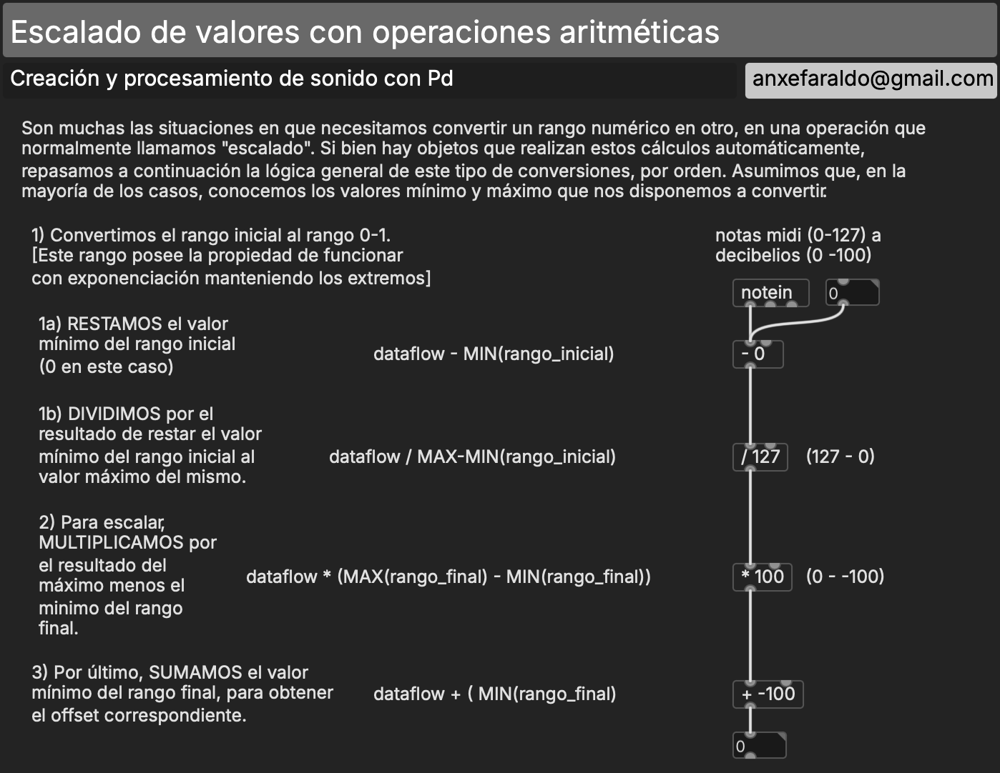

Un potenciómetro manda valores de 0 a 127; el tempo necesita, por ejemplo, de 60 a 600 ms. Hay que **escalar**: restar el mínimo, dividir por el rango, multiplicar por el rango nuevo y sumar su mínimo. `[scale]` de ELSE lo hace en una caja; conviene saber qué hace dentro.

Sin teclado MIDI, `[keymap]` de ELSE convierte el teclado del ordenador en uno.

### Del ritmo a la altura

#### Nancarrow, Cowell y el continuo

Henry Cowell propuso en *New Musical Resources* (escrito en 1919, publicado en 1930) que **ritmo y altura son el mismo fenómeno a distinta velocidad**: una proporción de tempo de 3:2 es la misma que hay entre las dos notas de una quinta. Conlon Nancarrow tomó la idea al pie de la letra. Escribió más de sesenta estudios para pianola, perforando los rollos a mano, con cánones a tempos que ningún pianista podría tocar.

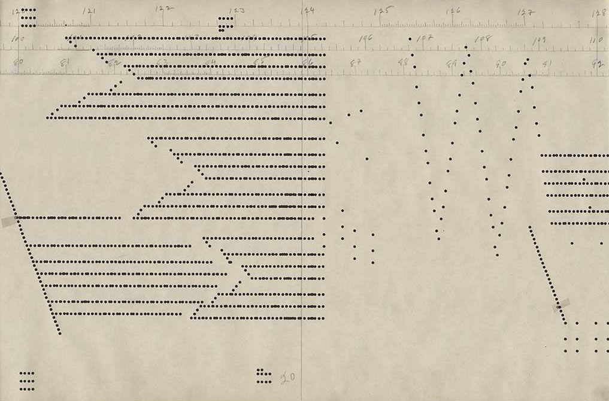

*Detalle de un rollo original del Estudio 49.*

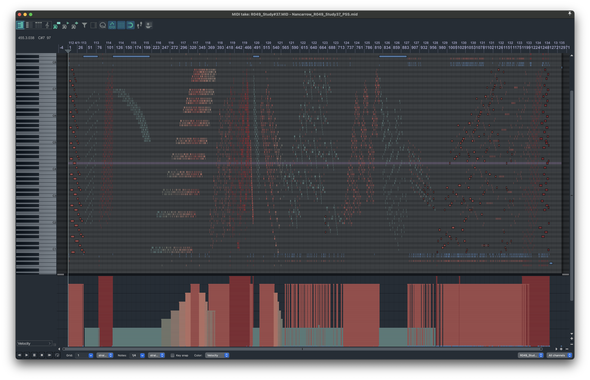

*El Estudio 37: un canon a doce voces con doce tempos distintos, en las proporciones de una escala justa. Ritmo y armonía con los mismos números. Aquí, en el piano roll de una DAW, a partir de la transcripción de la Fundación Paul Sacher.*

La idea es antigua: en la *Missa prolationum*, Ockeghem hace que varias voces lean la misma línea a velocidades distintas.

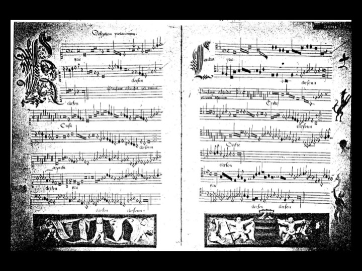

#### El límite de lo simbólico

Si aceleramos el secuenciador (8 notas por segundo, 16, 30…), hacia las 20 por segundo dejamos de oír notas y empezamos a oír un tono. Pero por ese camino no podemos seguir: los mensajes de control de Pd se calculan entre bloques de audio (cada milisegundo y medio, aproximadamente), y un sinte MIDI no está hecho para recibir cientos de notas por segundo.

Para seguir acelerando necesitamos un pulso que viva a la velocidad del audio. `[phasor~]` es una rampa que va de 0 a 1 una y otra vez: a 2 Hz se oyen golpes; a 200 Hz, una altura. **El ritmo se ha convertido en altura.** Ese mismo `[phasor~]` será, en la S3, el lector de los sonidos grabados.

#### Señal frente a control

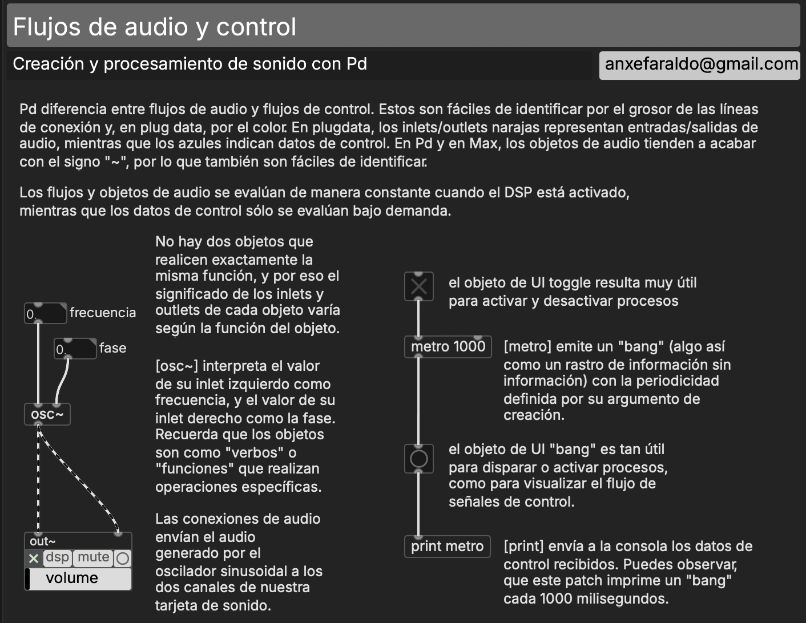

La tilde (`~`) indica que el objeto trabaja con **señal**: un flujo continuo de números a la frecuencia de muestreo (44.100 o 48.000 por segundo), frente a los mensajes de control, que solo existen cuando ocurre algo.

- **Señal (audio rate).** Evaluación continua, al ritmo del reloj de audio. Se enciende y se apaga explícitamente (DSP). Cables gruesos.
- **Control.** Evaluación bajo demanda: algo pasa cuando llega un mensaje. Cables finos.

#### El primer sinte propio

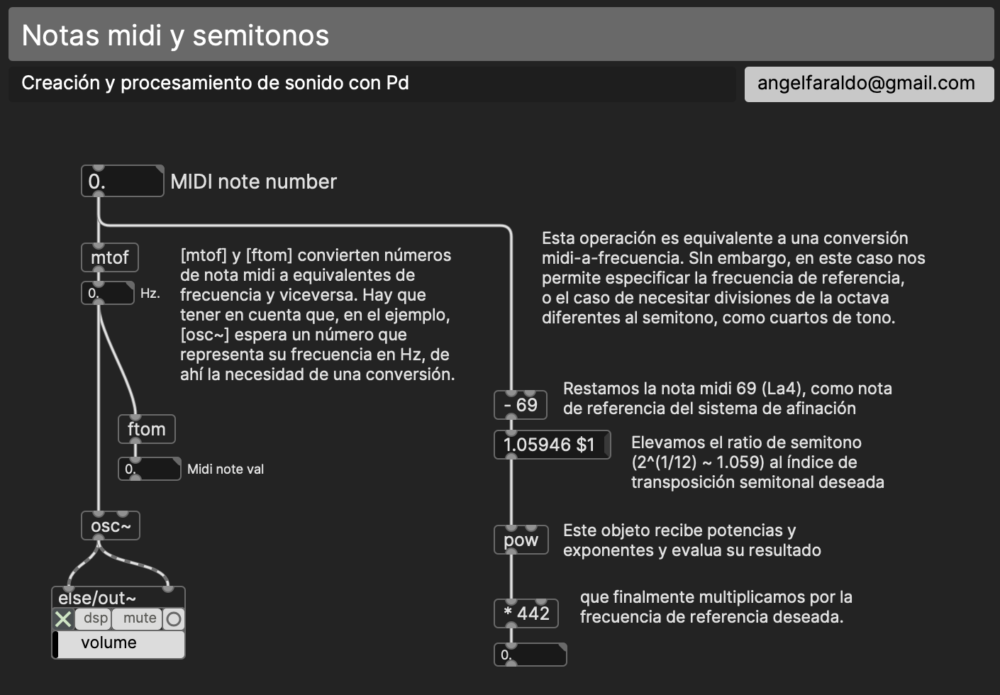

`[mtof]` convierte un número de nota en frecuencia (Hz) y `[osc~]` produce una sinusoide a esa frecuencia. Lo que en la DAW hacía el sinte por ti (la envolvente, el volumen, la salida) aquí lo construyes: `[vline~]` dibuja la envolvente, `[*~]` la aplica y `[dac~]` manda el resultado a la tarjeta de sonido.

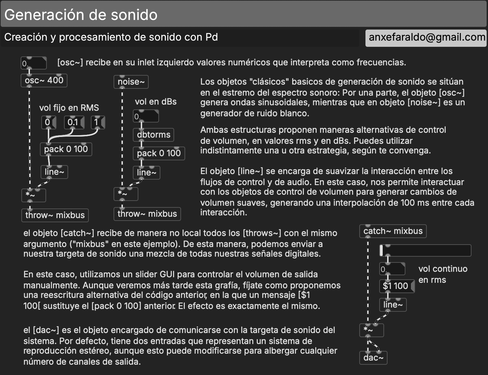

En el *object browser* de plugdata los generadores están en «Signal Generators» y «Random and Noise». Los dos extremos del espectro: la sinusoide (`[osc~]`) y el ruido blanco (`[noise~]`).

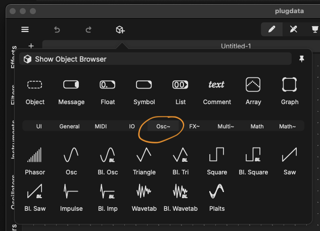

`[send~]`/`[receive~]` y `[throw~]`/`[catch~]` hacen con la señal lo que `[send]`/`[receive]` hacen con los mensajes. `[throw~]`/`[catch~]` suman: varias fuentes, un solo bus de salida.

!!! tip "Ten un espectrograma abierto"
    A partir de hoy, cuando algo suene, míralo además de oírlo. El objeto de espectrograma de ELSE nos acompañará todo el curso.

??? info "Para saber más (fuera de clase)"
    **Otros mensajes MIDI.** Además de notas, MIDI transporta controladores (`[ctlout]`), cambios de programa (`[pgmout]`), *pitch bend* (`[bendout]`) y *aftertouch*.

    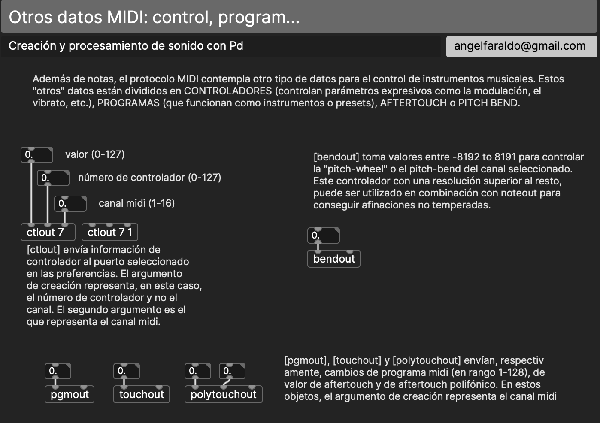

    **Alturas fuera del temperamento** con *pitch bend*:

    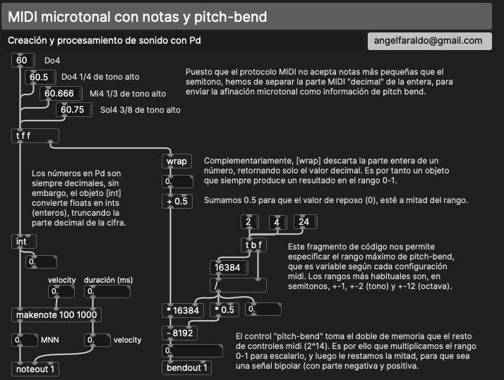

    **Pd escuchando a la DAW.** Como plugin, plugdata puede leer la posición del cursor y el tempo de la DAW con `[playhead]`, y exponer parámetros automatizables con `[param]`.

    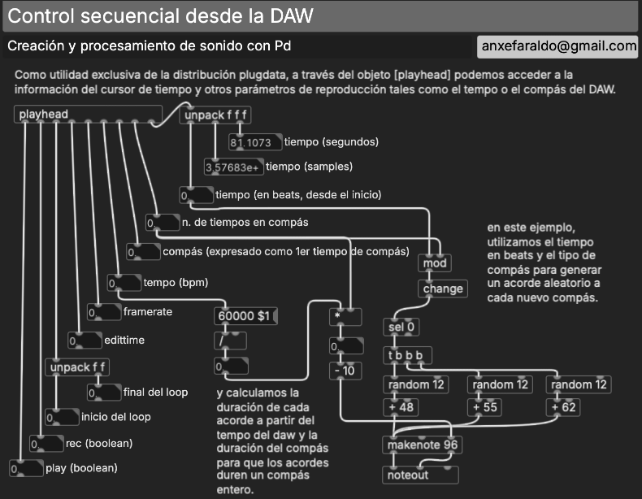

    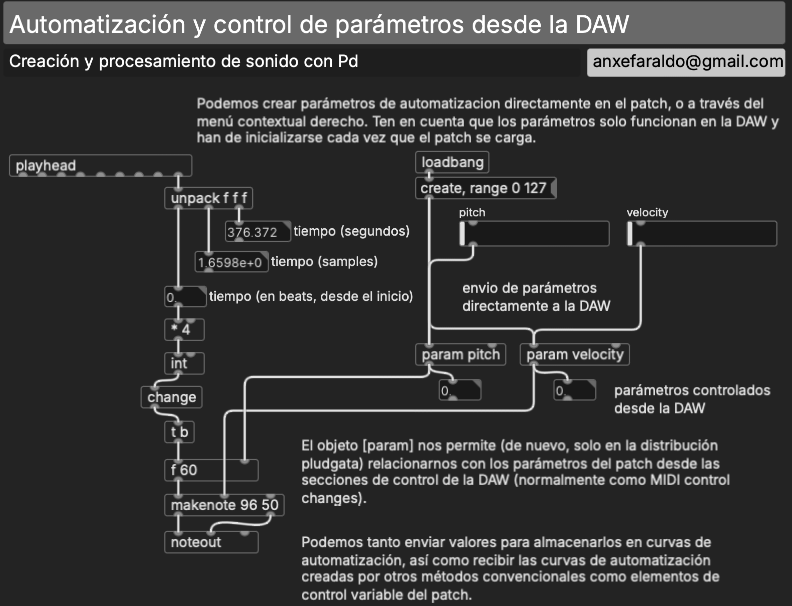

    **Lecturas en la red:** [Robert Willey, *Electronic Realizations of Nancarrow's Study No. 37*](http://www.willshare.com/willeyrk/creative/papers/study37/) · [Michael Connor, *The impossible music of Black MIDI*](https://rhizome.org/editorial/2013/sep/23/impossible-music-black-midi/).

## Patches de referencia

Los patches de referencia de esta sesión se publican aquí al acabar la clase. En clase no se reparten antes: se construyen.

## En la documentación de Pd

- `2.control.examples`: 15–16 (arrays), 18 (condicionales), 19 (azar), 23 (secuencias), 24 (bucles).
- `3.audio.examples`: A01–A06 (sinusoide, amplitud, `line~`, salida, frecuencia), D01–D02 (envolventes, ADSR), C01 (Nyquist).

## Encargo

[E2 · Secuenciador isorrítmico](../encargos/e2.md), para el domingo 8 de noviembre.
