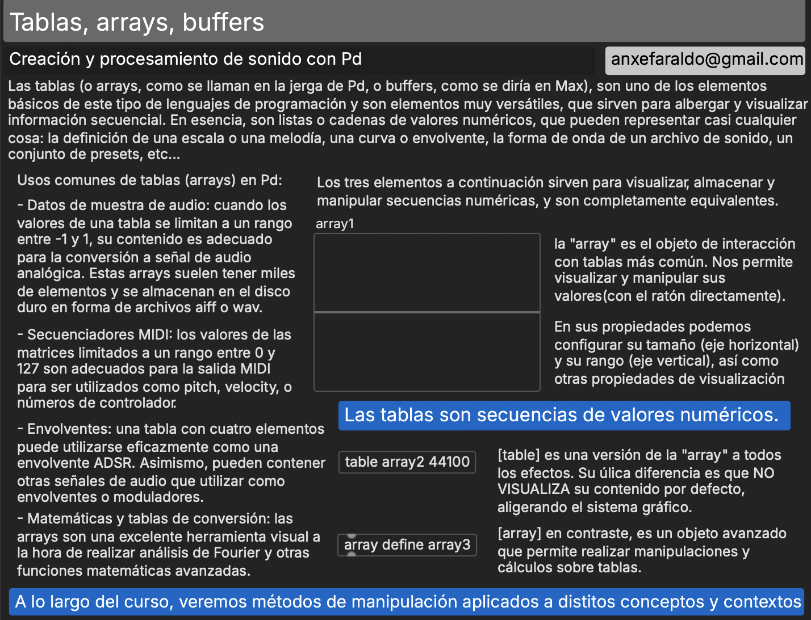
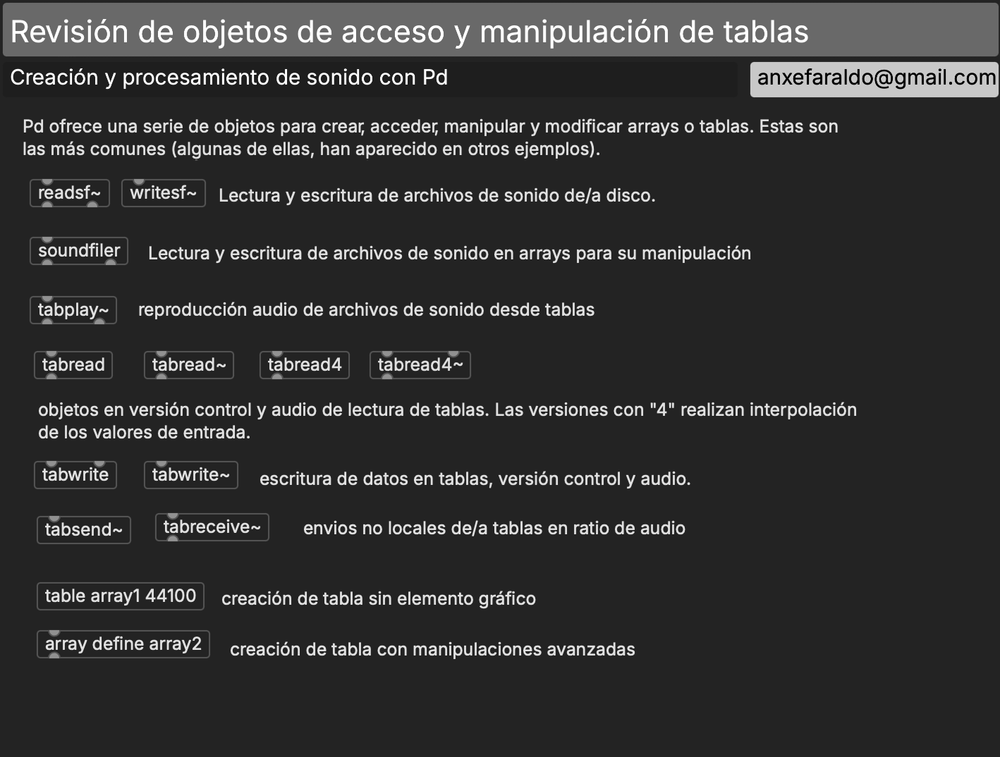
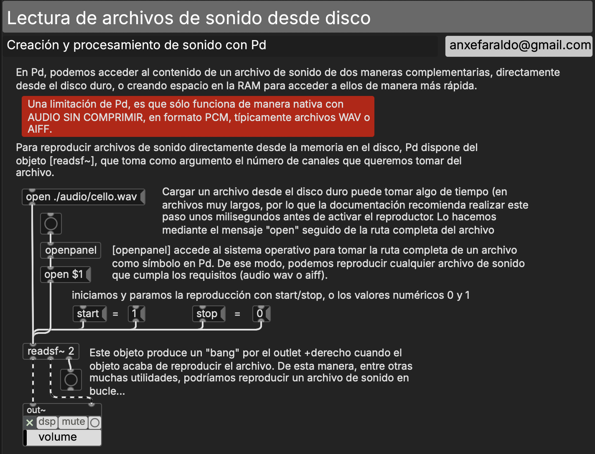
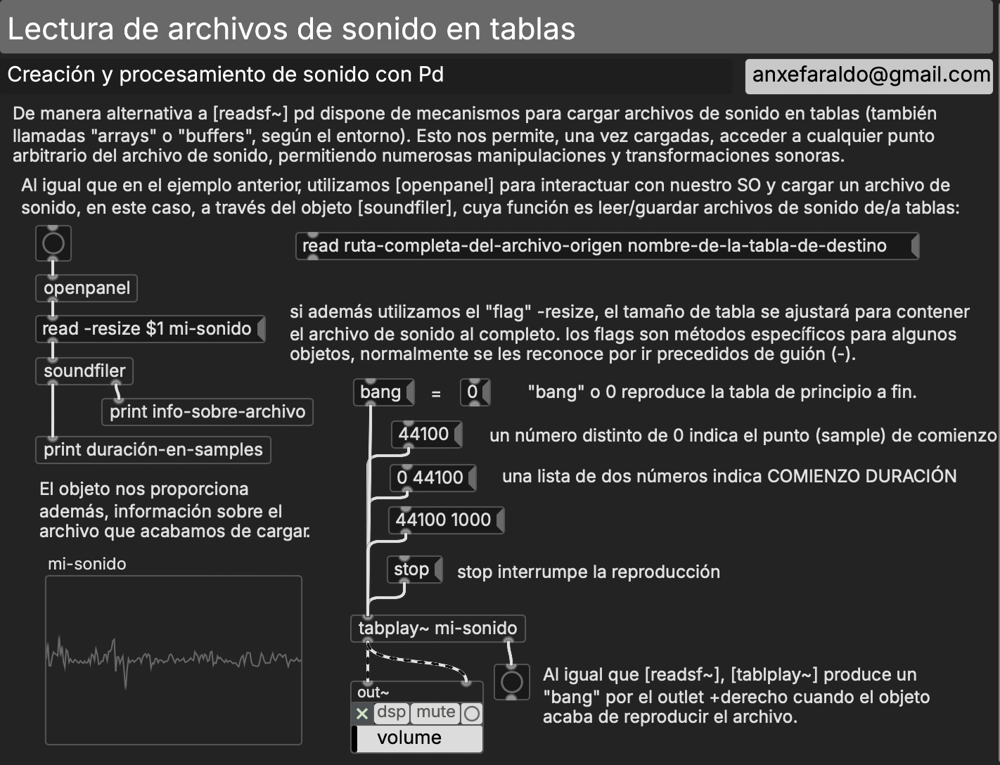
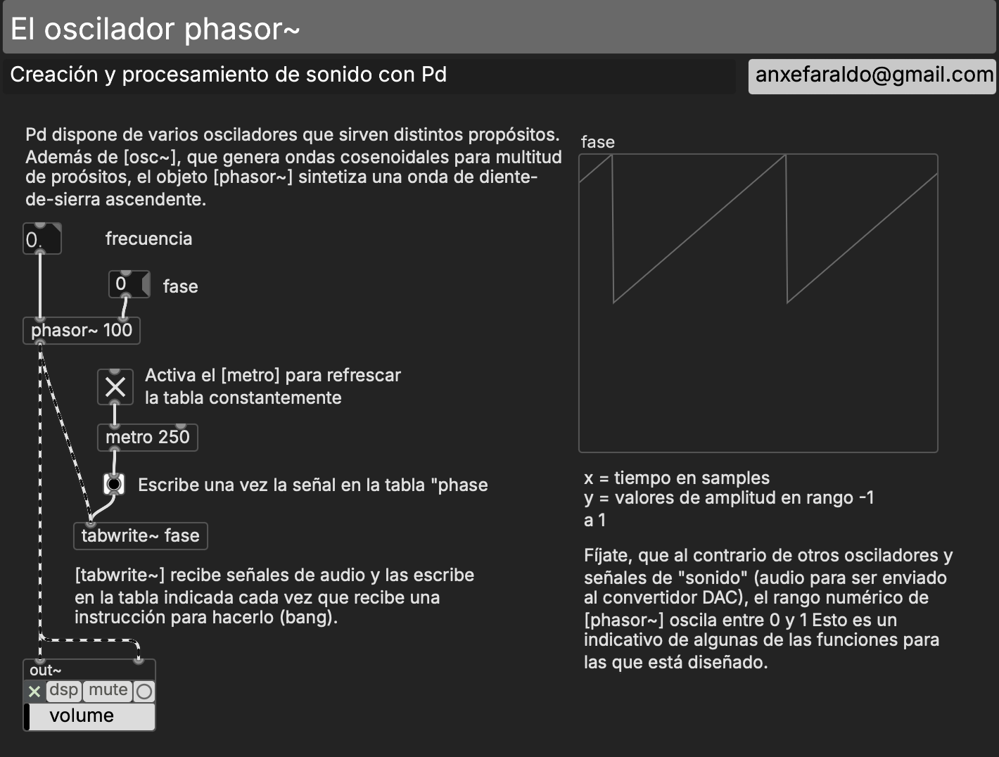
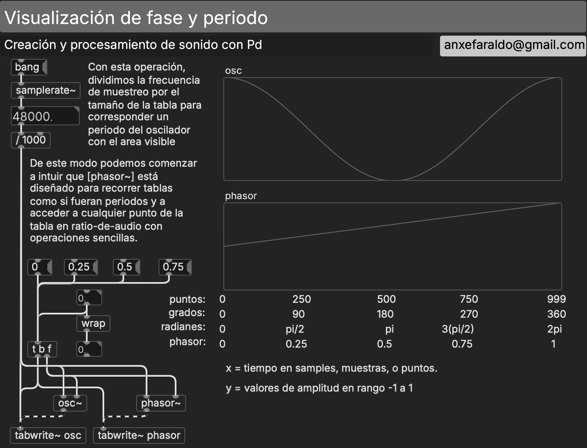
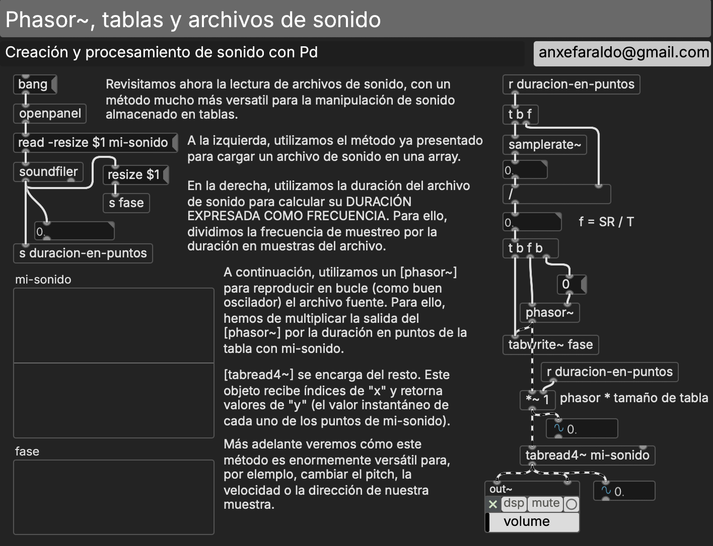
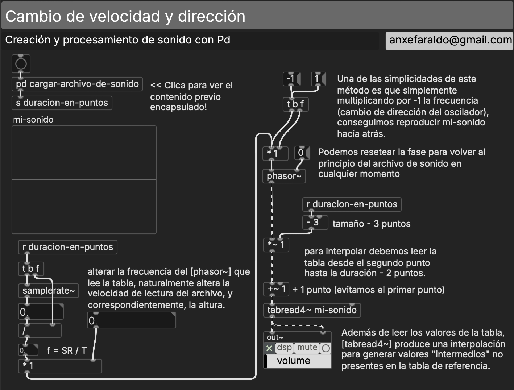
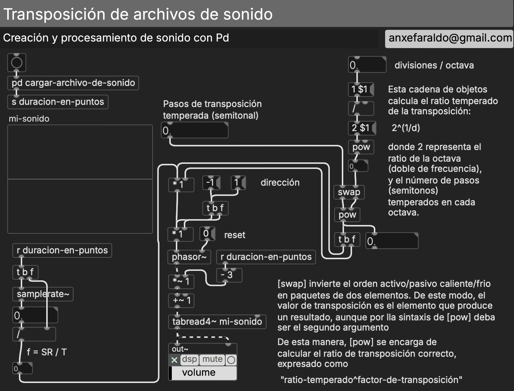
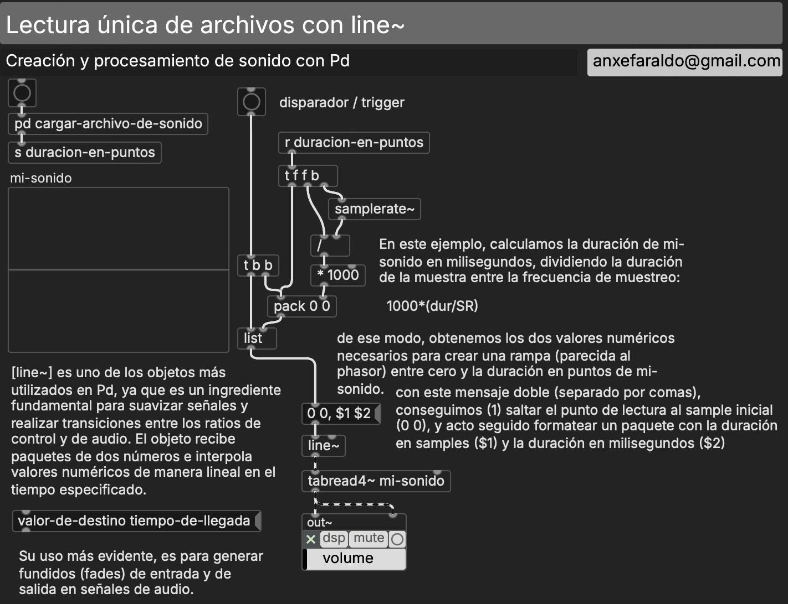

# S3 · Manipulación de sonido grabado

!!! note "Sesión 3 · domingo 8 de noviembre de 2026 · 11:30–14:30 y 15:30–18:00"
    **Antes de venir:** entrega [E2](../encargos/e2.md). Trae **tres a cinco sonidos grabados por ti** (voz, objetos, instrumento, calle), de entre 2 y 20 segundos, en cualquier formato. Serán tu material de trabajo hasta enero.

¿Se oye la lectura o se oye el material?

<ol>
<li data-src="audio/s3/el-dabh-expression-of-zaar.mp3"><b>Halim El-Dabh</b> · <i>The Expression of Zaar</i> (1944)</li>
<li data-src="audio/s3/ellison-sonic-phantoms.mp3"><b>Barbara Ellison</b> · <i>Sonic Phantoms</i> (2018)</li>
<li data-src="audio/s3/reich-its-gonna-rain.mp3"><b>Steve Reich</b> · <i>It's Gonna Rain</i> (1965)</li>
</ol>

## Plan de la sesión

Sesión más corta que las demás: no hay taller de tarde.

**Mañana**

1. Defensa de encargos (E2).
2. Reconstrucción, sin apuntes: el secuenciador de tabla de la S2 con su envolvente. Y una pregunta: ¿qué pasa si el contador corre a 44.100 pasos por segundo?
3. El sonido es una tabla: cargar un archivo en un `[array]`, leerlo con `[phasor~]` y `[tabread4~]`. Velocidad, dirección y transposición.
4. Taller: cada una construye su lector con su propio material.

**Tarde**

1. Escucha (ver abajo).
2. Del lector al sampler: el teclado del ordenador como instrumento, comienzo y duración de cada fragmento, envolventes para evitar clics.
3. Escucha de algunos lectores y presentación del encargo [E3](../encargos/e3.md).

## Contenidos de referencia

### De lo concreto

La música concreta parte de la grabación y manipulación de sonidos sobre soporte fijo, y de una estética del *objeto sonoro*: un sonido considerado en sí mismo, separado de la causa que lo produjo.

> «The sound object must not be confused with the sounding body by which it is produced.»
> — Pierre Schaeffer

En 1944, cuatro años antes de los primeros estudios de Schaeffer, Halim El-Dabh grabó en las calles de El Cairo con una grabadora de cable y transformó el material en *The Expression of Zaar*.

- 1948 · Pierre Schaeffer, *Cinq études de bruits*.
- 1951 · Groupe de Recherche de Musique Concrète, con Pierre Henry.
- 1958 · Groupe de Recherches Musicales (GRM). Música acusmática.
- 1958 · Varèse, Le Corbusier y Xenakis: Pabellón Philips.
- 1966 · Schaeffer, *Traité des objets musicaux*.
- 1974 · François Bayle, Acousmonium: la orquesta de altavoces.

*Pabellón Philips (1958): arquitectura de Xenakis y Le Corbusier, «Poème électronique» de Varèse y «Concret PH» de Xenakis.*

Más allá de lo concreto: Luciano Berio, *Thema (Omaggio a Joyce)* (1958), sobre la voz de Cathy Berberian · Steve Reich, *It's Gonna Rain* (1965), dos bucles iguales que se desfasan · James Tenney, *Collage #1 «Blue Suede»* (1961) · John Oswald, *Plunderphonics* (1985) · Alberto Bernal, *G8* (2007) · Barbara Ellison, *Sonic Phantoms* (2018).

### Tablas, arrays, buffers

Una tabla es una secuencia de números. En la S1 contenía una escala; en la S2, una partitura. Hoy contiene un sonido: decenas de miles de valores entre −1 y 1 por segundo.

### Cargar un sonido

Pd puede leer un archivo de dos maneras: directamente desde el disco, o cargándolo en memoria, en una tabla, para manipularlo.

En vanilla, `[soundfiler]` carga WAV y AIFF. En clase usaremos `[sfload]` de ELSE, que carga cualquier formato (mp3, flac, ogg…) en un `[array]`. La lectura la haremos nosotros, porque es donde está la música.

### El índice compone: `[phasor~]`

`[phasor~]` es una rampa que va de 0 a 1 una y otra vez: el **contador de la S1, corriendo a velocidad de audio**. Multiplicado por el tamaño de la tabla, se convierte en un índice que la recorre.

Si la frecuencia del `[phasor~]` es la inversa de la duración del sonido (frecuencia de muestreo / número de muestras), la tabla se lee a su velocidad original. Todo lo demás es cambiar esa frecuencia.

### Velocidad, dirección y altura

Leer el doble de rápido sube una octava y dura la mitad; una frecuencia negativa lee hacia atrás. Velocidad y altura están acopladas, como en una cinta.

Para transportar en semitonos temperados: ratio = 2^(n/12).

`[tabread4~]` interpola entre muestras (lee «entre» dos valores), por eso no suena áspero cuando leemos a velocidades que no son enteras.

### Leer una vez

`[line~]` (o `[vline~]`) hace una sola rampa: del punto de comienzo al final, en el tiempo que le digamos. Es la base del sampler: cada tecla, un comienzo y una duración. Y una envolvente corta al principio y al final de cada fragmento evita los clics.

## Lecturas

- Cox, C. y Warner, D. (eds.) (2017). *Audio Culture: Readings in Modern Music* (ed. revisada). Antología de textos de compositores y teóricos, de la música concreta al *sampling*. [PDF](https://lamembrana.com/radio-katarina/lecturas/cox-warner-audio-culture.pdf)

## Patches de referencia

Los patches de referencia de esta sesión se publican aquí al acabar la clase. En clase no se reparten antes: se construyen.

## En la documentación de Pd

- `3.audio.examples`: B01–B04 (wavetables, `tabread4~`, interpolación), B07–B12 (scratch, bucles, bucle deslizante, sin doppler, transposición), B15–B16, C05 (sampler de un disparo).

## Encargo

[E3 · Sampler](../encargos/e3.md), para el sábado 28 de noviembre.
