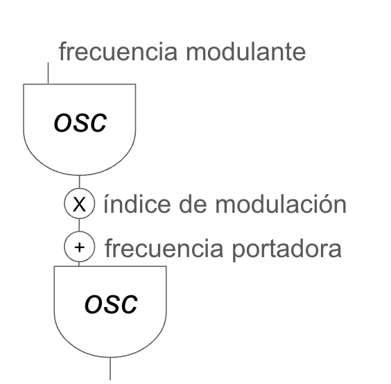

# S5 · Distorsión, funciones de transferencia y síntesis por modulación

!!! note "Sesión 5 · sábado 5 de diciembre de 2026"
    **Antes de venir:** entrega [E4](../encargos/e4.md). Hoy se defienden E3 y E4.

¿La distorsión está en el sonido o en quien escucha?

<ol>
<li data-src="audio/s5/chowning-stria.mp3"><b>John Chowning</b> · <i>Stria</i> (1977)</li>
<li data-src="audio/s5/amacher-sound-characters.mp3"><b>Maryanne Amacher</b> · <i>Sound Characters</i> (1999)</li>
<li data-src="audio/s5/puce-mary-the-drought.mp3"><b>Puce Mary</b> · <i>The Drought</i> (2018)</li>
</ol>

## Plan de la sesión

**Mañana**

1. Defensa de encargos (E3 y E4).
2. Reconstrucción, sin apuntes: el lector de tabla de la S3, `[phasor~]` → `[tabread4~]`.
3. Deformar: si en lugar de un `[phasor~]` el índice de la tabla es una sinusoide, la tabla deja de ser un sonido y pasa a ser una **función de transferencia**. Waveshaping y distorsión.
4. Taller de predicción: antes de escuchar cada función, dibuja el espectro que esperas.

**Tarde**

1. Escucha: John Chowning, *Stria* (1977) · Maryanne Amacher, *Sound Characters* (1999). ¿La distorsión está en el sonido o en quien escucha?
2. Generar: un oscilador que modula a otro. AM, modulación en anillo y FM como una sola familia.
3. Taller de composición: una fuente, dos no linealidades.
4. Presentación del encargo [E5](../encargos/e5.md).

## Contenidos de referencia

### Lineal y no lineal

Un sistema **lineal** (un filtro, un delay, un cambio de volumen) puede cambiar la amplitud y la fase de las frecuencias que recibe, pero no crea frecuencias nuevas. Un sistema **no lineal** sí: a la salida aparecen componentes que no estaban en la entrada. Es la frontera de esta sesión, y desde aquí el curso empieza a pensar en espectros.

### Funciones de transferencia

Una función de transferencia asigna a cada valor de entrada un valor de salida. En Pd es literalmente una tabla leída con `[tabread4~]`, como en la S3; la diferencia es que el índice ya no es una rampa, sino la propia señal.

- Una recta: la señal sale igual.
- Una curva que se aplana en los extremos: saturación suave.
- Un corte brusco: *clipping*, distorsión dura.
- Un polinomio de Chebyshev: armónicos concretos, elegidos de antemano.

Cuanto más fuerte entra la señal, más recorre la función y más se deforma: el timbre depende de la intensidad, como en los instrumentos acústicos.

### Modulación

- **Modulación de amplitud (AM) y en anillo (RM):** se multiplican dos señales. Aparecen la suma y la diferencia de sus frecuencias (**bandas laterales**).
- **Modulación de frecuencia (FM):** un oscilador modula la frecuencia de otro. Con una sola pareja aparecen muchas bandas laterales, separadas por la frecuencia moduladora. El **índice de modulación** decide cuántas son audibles; la **razón** entre portadora y moduladora decide si el resultado es armónico o inarmónico.

La FM es, en el fondo, otra no linealidad: una sinusoide aplicada a la fase de otra. Por eso estudiamos distorsión y modulación juntas: el mismo mecanismo produce el mismo fenómeno.

### Aliasing

Si una no linealidad genera frecuencias por encima de la mitad de la frecuencia de muestreo (Nyquist), estas no desaparecen: se reflejan hacia abajo y suenan donde no deberían. Hoy es la primera vez que se oye de verdad. Escúchalo y míralo en el espectrograma.

### Contexto

John Chowning descubrió la síntesis FM en Stanford a finales de los sesenta. Stanford la patentó y la licenció a Yamaha, que la llevó al DX7 (1983), uno de los sintetizadores más vendidos de la historia: una técnica de laboratorio convertida en el sonido de una década.

## Lecturas

- Chowning, J. (1973). The Synthesis of Complex Audio Spectra by Means of Frequency Modulation. *Journal of the Audio Engineering Society*, 21(7). El artículo que lo empezó todo. [PDF](https://lamembrana.com/radio-katarina/lecturas/chowning-1973-fm.pdf)
- Chowning, J. y Bristow, D. (1986). *FM Theory and Applications: By Musicians for Musicians*. Yamaha. [PDF](https://lamembrana.com/radio-katarina/lecturas/chowning-bristow-fm-theory-and-applications.pdf)

## Patches de referencia

Los patches de referencia de esta sesión se publican aquí al acabar la clase. En clase no se reparten antes: se construyen.

## En la documentación de Pd

- `3.audio.examples`: E01 (espectro), E02 (modulación en anillo), E05 (Chebyshev), E06 (exponencial), E08 (modulación de fase), E09–E10 (espectros FM), C02 (*foldover*, aliasing), F04 (waveshaping).

## Encargo

[E5 · Voz no lineal](../encargos/e5.md), para el sábado 19 de diciembre.
