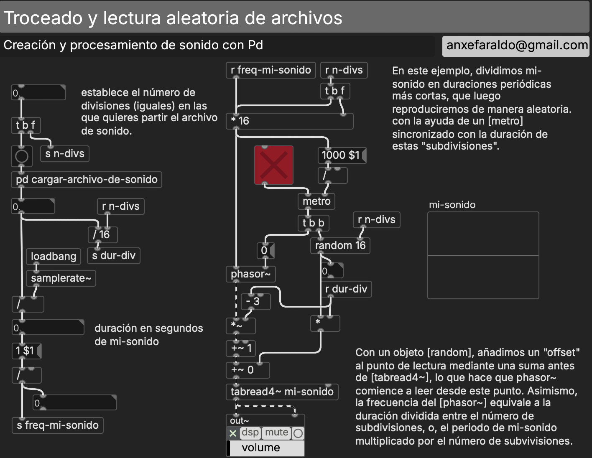
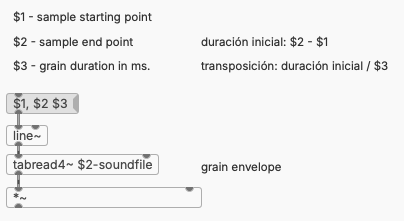
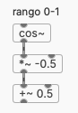
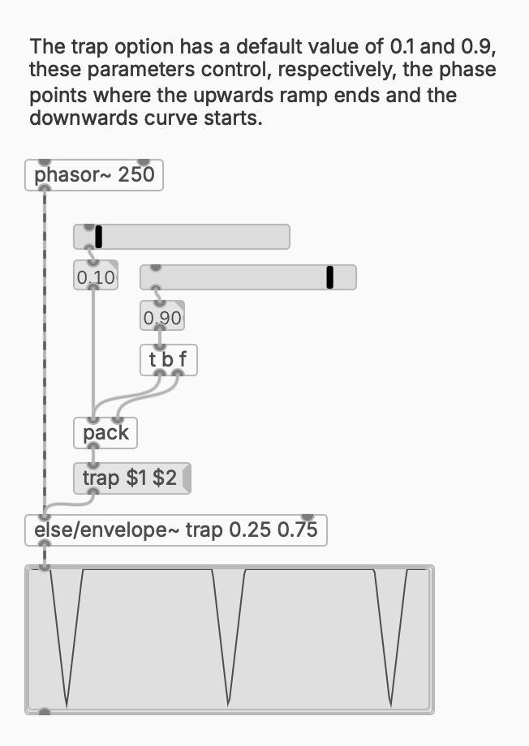
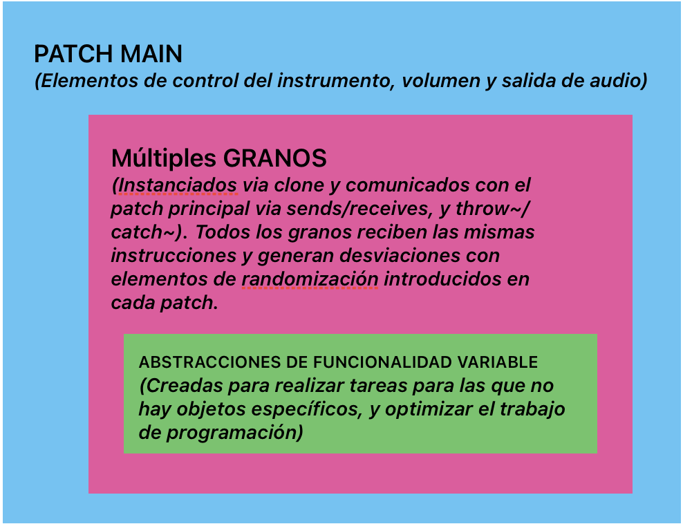
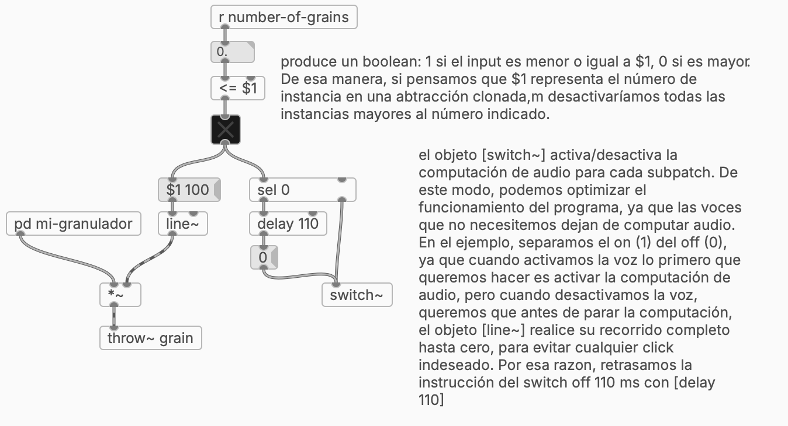
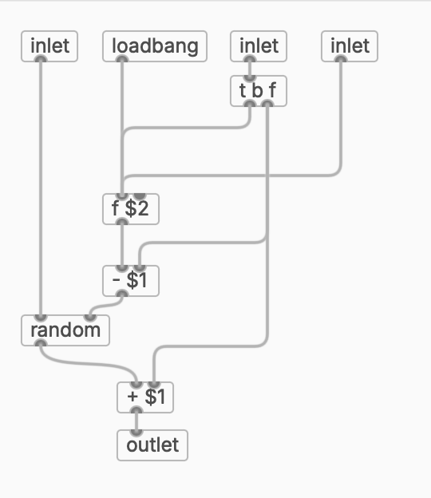

# S7 · Síntesis granular

!!! note "Sesión 7 · sábado 16 de enero de 2027"
    **Antes de venir:** entrega [E6](../encargos/e6.md). Trae tus sonidos de la S3: hoy vuelven.

¿Dónde pasa el grano a ser textura?

<ol>
<li data-src="audio/s7/xenakis-concret-ph.mp3"><b>Iannis Xenakis</b> · <i>Concret PH</i> (1958)</li>
<li data-src="audio/s7/truax-riverrun.mp3"><b>Barry Truax</b> · <i>Riverrun</i> (1986)</li>
</ol>

## Plan de la sesión

**Mañana**

1. Defensa de encargos (E6).
2. Reconstrucción, sin apuntes: un parcial de la S6 como abstracción con `$1` dentro de `[clone]`, con su envolvente.
3. Del fragmento al grano: trocear un sonido y leerlo al azar (micromontaje); acortar los fragmentos hasta que dejen de oírse como fragmentos. Un grano: una lectura de tabla de pocos milisegundos con una envolvente.
4. Taller: tu grano, sobre tu material.

**Tarde**

1. Escucha: Iannis Xenakis, *Concret PH* (1958) · Barry Truax, *Riverrun* (1986). ¿Dónde pasa el grano a ser textura?
2. La nube: muchas voces de grano con `[clone]`, densidad, dispersión y distribuciones de probabilidad.
3. Taller de composición: una textura que cambia.
4. Presentación del encargo [E7](../encargos/e7.md).

## Contenidos de referencia

### El microsonido

En 1947, el físico Dennis Gabor propuso que todo sonido puede describirse como una sucesión de **cuantos acústicos**: partículas breves con una frecuencia y una duración. Cuanto más corto es el grano, más precisa es su posición en el tiempo y menos precisa su frecuencia, y al revés. Ese compromiso entre tiempo y frecuencia reaparecerá en la S8.

Xenakis lleva la idea a la composición (*Analogique B*, 1959; *Formalized Music*); Curtis Roads hace las primeras síntesis granulares por ordenador en los años setenta; Barry Truax, la primera en tiempo real (*Riverrun*, 1986). Horacio Vaggione desarrolla el **micromontaje**: componer con fragmentos minúsculos de sonido grabado.

Presentación de clase: [On Granular, Concatenative & Non-Standard Synthesis](../materiales/sintesis-granular-concatenativa.pdf) (PDF).

### Del troceado al grano

Dividir un sonido en fragmentos iguales y leerlos en orden aleatorio es el puente entre la S3 y hoy. Si los fragmentos se acortan por debajo de unos 50 ms y se superponen, dejamos de oír fragmentos y empezamos a oír una textura.

### Un grano

Un grano es una lectura de tabla con tres datos: punto de comienzo, punto final y duración. Su relación decide la transposición. Sin envolvente, cada grano produce un clic.

*La envolvente del grano es una ventana: la misma idea con la que la S8 abrirá el análisis espectral.*

### La nube

Un granulador es una abstracción de grano instanciada con `[clone]`, controlada desde un patch principal. Todas las voces reciben las mismas instrucciones, pero cada una se desvía de ellas al azar.

Parámetros habituales: número de granos, densidad (tiempo entre ataques), duración del grano, posición de lectura y su dispersión, transposición, panorama.

### Azar con forma

El azar uniforme de la S1 da a todos los valores la misma probabilidad. Las **distribuciones** concentran los valores alrededor de una media (normal, triangular) y deciden cuánto se alejan de ella: la diferencia entre una nube compacta y una dispersa. En vanilla se construyen con abstracciones; ELSE trae `[rand.dist]`.

## Patches de referencia

Los patches de referencia de esta sesión se publican aquí al acabar la clase. En clase no se reparten antes: se construyen.

## En la documentación de Pd

- `2.control.examples`: 19 (azar), 20 (azar ponderado).
- `3.audio.examples`: B13 (sampler con solapamiento), B14, F06–F07 (paquetes de onda), F14, D11 (sampler polifónico).

## Lecturas

- Roads, C. (2006). *The Evolution of Granular Synthesis: An Overview*. [PDF](https://lamembrana.com/radio-katarina/lecturas/roads-2006-evolution-of-granular-synthesis.pdf)
- Bencina, R. (2001). *Implementing Real-time Granular Synthesis*. [PDF](https://lamembrana.com/radio-katarina/lecturas/bencina-2001-real-time-granular-synthesis.pdf)
- Vaggione, H. (1996). *Articulating Microtime*. *Computer Music Journal*, 20(2). [PDF](https://lamembrana.com/radio-katarina/lecturas/vaggione-1996-articulating-microtime.pdf)
- Roads, C. (2005). *The Art of Articulation: The Electroacoustic Music of Horacio Vaggione*. [PDF](https://lamembrana.com/radio-katarina/lecturas/roads-2005-art-of-articulation.pdf)

## Encargo

[E7 · Granulador](../encargos/e7.md), para el sábado 30 de enero.
