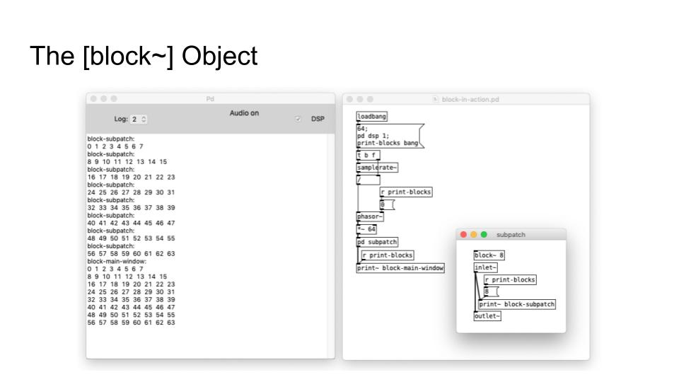

# S8 · Análisis espectral: FFT, descriptores y síntesis concatenativa

!!! note "Sesión 8 · sábado 30 de enero de 2027"
    **Prueba de nivel 2:** a primera hora, dos horas. En el aula, sin conexión a internet. Cubre las sesiones 4 a 7.

    **Antes de venir:** entrega [E7](../encargos/e7.md). Se defiende al final de la sesión.

¿Qué oye el análisis que tú no oyes?

<ol>
<li data-src="audio/s8/harvey-mortuos-plango.mp3"><b>Jonathan Harvey</b> · <i>Mortuos Plango, Vivos Voco</i> (1980)</li>
</ol>

## Plan de la sesión

**Mañana**

1. Prueba de nivel 2.
2. De la envolvente del grano a la ventana: cortar el sonido en ventanas solapadas, `[block~]` y la transformada de Fourier. Analizar y resintetizar sin cambiar nada.

**Tarde**

1. Escucha: Jonathan Harvey, *Mortuos Plango, Vivos Voco* (1980). ¿Qué oye el análisis que tú no oyes?
2. Transformar en el dominio espectral: congelar un sonido, filtrarlo bin a bin.
3. Para qué sirven los descriptores: del espectro a unos pocos números. La síntesis concatenativa.
4. Taller: tu material de la S3, por el procesado espectral.
5. Cierre del curso: defensas de E7.

## Contenidos de referencia

### Del grano a la ventana

En la S7, un grano era una lectura breve de una tabla multiplicada por una envolvente. El análisis espectral hace lo mismo de forma sistemática: corta la señal en **ventanas** solapadas (la envolvente del grano, ahora con nombre: Hann, Hamming…) y calcula el espectro de cada una.

### La transformada de Fourier

La FFT descompone cada ventana en un conjunto de **bins**: bandas de frecuencia, cada una con una amplitud y una fase. Es la síntesis aditiva de la S6 al revés: en lugar de sumar osciladores para construir un sonido, averigua qué osciladores harían falta para construir el que tenemos. Y es la granular de la S7 vista por dentro: cada ventana, un grano.

- **Tamaño de ventana:** con más muestras, más resolución en frecuencia y menos en tiempo. El compromiso de Gabor otra vez.
- **Solapamiento:** las ventanas se superponen para que la resíntesis no tenga huecos.
- **Identidad:** `[rfft~]` → `[rifft~]` devuelve el mismo sonido. Todo procesado espectral ocurre entre esos dos objetos.

En Pd, el análisis vive en un subpatch con su propio tamaño de bloque y solapamiento, que se fijan con `[block~]`.

Presentación de clase: [On Spectral Processing in Pd](../materiales/procesado-espectral.pdf) (PDF).

### Transformar el espectro

- **Congelar:** mantener la amplitud de una ventana y dejar que la fase avance. Un instante convertido en sonido sostenido.
- **Filtrar:** multiplicar cada bin por un valor de una tabla. Un ecualizador de cientos de bandas, dibujado a mano.
- **Puerta de ruido espectral:** eliminar los bins por debajo de un umbral.

### Descriptores y síntesis concatenativa

Un descriptor resume el espectro en un número: altura, intensidad, centroide (el «brillo»), ruidosidad. Con descriptores, un sistema puede **escuchar** y responder; esto lo trabajaremos en Música Electrónica en Vivo.

La síntesis concatenativa trocea un corpus de sonidos, los describe y reconstruye un sonido objetivo eligiendo, en cada momento, el fragmento del corpus que más se le parece. Es granular guiada por el análisis.

Presentaciones de clase: [On MIR, Audio Descriptors and Classification](../materiales/descriptores-audio.pdf) · [On Concatenative Synthesis](../materiales/sintesis-concatenativa.pdf) (PDF).

### Contexto

El algoritmo de la FFT (Cooley y Tukey, 1965) hizo calculable en la práctica lo que Fourier había formulado en el siglo XIX. El vocoder de fase y los centros como el IRCAM convirtieron el análisis en herramienta de composición: en *Mortuos Plango, Vivos Voco*, Harvey analiza la gran campana de la catedral de Winchester y la voz de su hijo, y transforma una en otra.

## Patches de referencia

Los patches de referencia de esta sesión se publican aquí al acabar la clase. En clase no se reparten antes: se construyen.

## En la documentación de Pd

- `3.audio.examples`: H07 (medir el espectro), I01 (análisis de Fourier), **I02 (ventana de Hann)**, I03 (resíntesis), I04 (puerta de ruido), I06 (timbre stamp), I07 (vocoder de fase).

## Después

Sesión 9 (13 de febrero): videocreación y música visual, con Manuel de Pablos.
